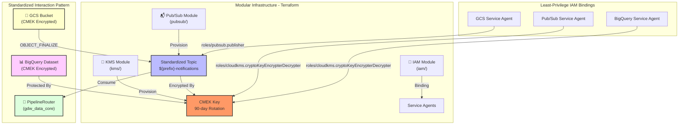

# 🏗️ LOA Blueprint - System Architecture

**Version:** 1.0  
**Last Updated:** December 21, 2025  
**Status:** Production Ready

---

## 📊 High-Level Architecture

```
┌─────────────────────────────────────────────────────────────────┐
│                      EXTERNAL SOURCES                           │
│  (Mainframe, Legacy Systems, APIs, IoT Events)                  │
└────────────────────────────┬────────────────────────────────────┘
                             │
            ┌────────────────┴────────────────┐
            ▼                                 ▼
┌───────────────────────┐         ┌───────────────────────┐
│   FILE INPUT LAYER    │         │  EVENT INPUT LAYER    │
│ (Batch Processing)    │         │ (Streaming/Real-time) │
│ ┌───────────────────┐ │         │ ┌───────────────────┐ │
│ │ GCS Input Bucket  │ │         │ │ Pub/Sub Topic     │ │
│ │ ├─ batch_a.csv    │ │         │ │ ├─ event_stream   │ │
│ │ └─ batch_b.csv    │ │         │ │ └─ iot_stream     │ │
│ └───────────────────┘ │         │ └───────────────────┘ │
└───────────┬───────────┘         └───────────┬───────────┘
            │                                 │
            ▼                                 ▼
┌─────────────────────────────────────────────────────────────────┐
│              DATA PROCESSING LAYER (Dataflow)                   │
│  ┌──────────────────────────────────────────────────────────┐   │
│  │ Intelligent Pipeline Selector / Router                    │   │
│  │ ├─ Detect event/file type (routing_config.yaml)           │   │
│  │ ├─ Extract metadata (XCom / Pub/Sub attributes)           │   │
│  │ └─ Dynamic Routing to appropriate Pipeline                │   │
│  └──────────────────────────────────────────────────────────┘   │
│  ┌──────────────────────────────────────────────────────────┐   │
│  │ Processing Modes (BasePipeline)                          │   │
│  │ ├─ Batch Mode: Bounded GCS Read                          │   │
│  │ ├─ Streaming Mode: Unbounded Pub/Sub Read                │   │
│  │ └─ Write: BQ Load Job (Batch) / Storage Write API (Real) │   │
│  └──────────────────────────────────────────────────────────┘   │
└────────────────────────────┬────────────────────────────────────┘
                             │
                    ┌────────┴────────┐
                    ▼                 ▼
        ┌───────────────────┐  ┌──────────────────┐
        │ LOAD TO BIGQUERY  │  │ ERROR HANDLING   │
        │ (Raw Dataset)     │  │ (Dead Letter)    │
        └─────────┬─────────┘  └──────────────────┘
                  │
                  ▼
┌─────────────────────────────────────────────────────────────────┐
│             DATA WAREHOUSE LAYER (BigQuery)                     │
│  ┌──────────────────────────────────────────────────────────┐   │
│  │ Raw Dataset                                              │   │
│  │ ├─ applications_raw                                      │   │
│  │ ├─ customers_raw                                         │   │
│  │ ├─ branches_raw                                          │   │
│  │ └─ collateral_raw                                        │   │
│  └──────────────────────────────────────────────────────────┘   │
└────────────────────────────┬────────────────────────────────────┘
                             │
                             ▼
┌─────────────────────────────────────────────────────────────────┐
│              TRANSFORMATION LAYER (dbt)                         │
│  ┌──────────────────────────────────────────────────────────┐   │
│  │ Staging Layer (dbt models)                               │   │
│  │ ├─ Clean & standardize data                              │   │
│  │ ├─ Add audit columns                                     │   │
│  │ ├─ Apply business rules                                  │   │
│  │ └─ Quality validations                                   │   │
│  └──────────────────────────────────────────────────────────┘   │
│  ┌──────────────────────────────────────────────────────────┐   │
│  │ Mart Layer (Analytics Models)                            │   │
│  │ ├─ Fact tables                                           │   │
│  │ ├─ Dimension tables                                      │   │
│  │ └─ Aggregations                                          │   │
│  └──────────────────────────────────────────────────────────┘   │
└────────────────────────────┬────────────────────────────────────┘
                             │
                    ┌────────┴────────┐
                    ▼                 ▼
        ┌───────────────────┐  ┌──────────────────┐
        │ ANALYTICS / BI    │  │ APIS              │
        │ (Looker, Tableau) │  │ (Cloud Run)       │
        └───────────────────┘  └──────────────────┘
```

---

## 🔄 Data Flow

### 1. Batch Workflow (Legacy JCL Pattern)

```
1. FILE ARRIVES (.ok trigger)
   └─ GCS input bucket (incoming/ directory)
   └─ GCS Storage Notification (OBJECT_FINALIZE)
   └─ Pub/Sub topic (loa-processing-notifications)
   └─ Airflow PubSubPullSensor (immediate trigger)

2. INTELLIGENT ROUTING
   └─ Extract GCS metadata from Pub/Sub attributes
   └─ PipelineSelector (Library) matches file pattern to Task ID
   └─ BranchPythonOperator routes to specific Dataflow task

3. VALIDATION & PRE-FLIGHT (Fail-Fast)
   └─ Structural check & Sampled Field-Level validation (Airflow)
   └─ BLOCK if any check fails to prevent costly Dataflow runs

4. TRANSFORMATION (Dataflow Batch)
   └─ BasePipeline (Batch Mode)
   └─ Heavyweight Field-level validation & PII masking
   └─ BigQuery Load Job (Standard)
```

### 2. Real-Time Workflow (Streaming Pattern)

```
1. EVENT ARRIVES
   └─ Pub/Sub Topic (Real-time stream)
   └─ LOAPubSubPullSensor (Library) extracts metadata

2. DYNAMIC ROUTING
   └─ PipelineSelector (Library) routes based on Entity Type
   └─ immediate hand-off to Streaming Dataflow Job

3. STREAMING PROCESSING (Dataflow Streaming)
   └─ BasePipeline (Streaming Mode)
   └─ Low-latency ReadFromPubSub
   └─ Real-time transformations & Quality checks
   └─ BigQuery Storage Write API (Millisecond latency)
```

### 3. Common Post-Processing (All Flows)

```
1. DATA QUALITY VALIDATION
   └─ BigQuery data quality checks (row counts, nulls)
   └─ Reconciliation against source counts
   └─ Alert on threshold violations

2. FILE ARCHIVING (FileArchiver - gdw_data_core)
   └─ Load archive policy from YAML config
   └─ Resolve path: archive/{entity}/{year}/{month}/{day}/{filename}
   └─ Atomic move: GCS copy + delete source
   └─ Record to Audit Trail (Pub/Sub)
   └─ Push ArchiveResult to XCom

3. ERROR HANDLING
   └─ Failed files → Error bucket: error/{timestamp}/{filename}
   └─ Error notification published to Pub/Sub
   └─ Manual review queued

4. NOTIFICATIONS & AUDIT
   └─ Success/Failure notification to Pub/Sub
   └─ Audit events published (AuditTrail)
   └─ Metrics updated (files_processed, files_archived)
```

### 4. File Lifecycle Buckets

```
┌─────────────────────────────────────────────────────────────────────────┐
│                       GCS BUCKET ARCHITECTURE                            │
├─────────────────────────────────────────────────────────────────────────┤
│                                                                          │
│  ┌──────────────────┐                                                    │
│  │  INPUT BUCKET    │  (loa-migration-data)                              │
│  │  incoming/       │                                                    │
│  │  ├─ *.csv        │──────────────────┐                                 │
│  │  └─ *.ok         │                  │                                 │
│  └──────────────────┘                  │                                 │
│           │                            │                                 │
│           ▼                            ▼                                 │
│  ┌──────────────────┐        ┌──────────────────┐                        │
│  │  TEMP BUCKET     │        │  BigQuery        │                        │
│  │  (processing/)   │───────▶│  (loa_processed) │                        │
│  │  └─ Dataflow     │        └──────────────────┘                        │
│  └──────────────────┘                                                    │
│           │                                                              │
│           │ On Success              On Failure                           │
│           ▼                              │                               │
│  ┌──────────────────┐        ┌──────────────────┐                        │
│  │  ARCHIVE BUCKET  │        │  ERROR BUCKET    │                        │
│  │  (loa-archive)   │        │  (loa-error)     │                        │
│  │  archive/        │        │  error/          │                        │
│  │  ├─ entity/      │        │  ├─ timestamp/   │                        │
│  │  │  └─ year/     │        │  │  └─ file.csv  │                        │
│  │  │     └─ month/ │        │  └─ (7-day TTL)  │                        │
│  │  │        └─ day/│        └──────────────────┘                        │
│  │  │           └─ file.csv                                              │
│  │  │                                                                    │
│  │  ├─ Versioned (prod only)                                             │
│  │  ├─ CMEK encrypted                                                    │
│  │  └─ 7-year retention                                                  │
│  └──────────────────┘                                                    │
│                                                                          │
└─────────────────────────────────────────────────────────────────────────┘
```

### 5. Archive Policy Configuration

The archive path resolution is config-driven via YAML:

```yaml
# archive_config.yaml
archive_policies:
  - name: "standard_daily"
    pattern: "archive/{entity}/{year}/{month}/{day}/{filename}"
    collision_strategy: "timestamp"  # or "uuid", "version"
    retention_days: 365
    enabled: true

  - name: "applications"
    pattern: "archive/applications/{year}/{month}/{day}/{filename}"
    collision_strategy: "timestamp"
    retention_days: 2555  # 7 years for compliance
    enabled: true

default_policy: "applications"
```

**Collision Strategies:**
| Strategy | Example Output |
|----------|----------------|
| `timestamp` | `file_20260101_143022.csv` |
| `uuid` | `file_a1b2c3d4.csv` |
| `version` | `file_v2.csv` |

---

## 🗂️ Components & Technologies

### Data Ingestion
- **GCS Buckets:** File storage (input, archive, error, quarantine)
- **Pub/Sub Topics:** Event notifications
- **Cloud Functions:** Triggered processing

### Data Processing
- **Dataflow (Apache Beam):** Unified batch and streaming processing
- **BasePipeline (Library):** Reusable abstract class with dual-mode support
- **PipelineSelector (Library):** Metadata-driven routing engine (YAML config)
- **Validation Framework:** Data quality checks (Field, Schema, Footer)
- **Storage Write API:** Low-latency BigQuery ingestion for streaming
- **Error Recovery:** Automated cleanup on pipeline failure

### Data Storage
- **BigQuery:** Data warehouse
- **Cloud SQL:** Metadata store
- **Redis:** Caching layer

### Transformation
- **dbt:** Transformation orchestration
- **Macros:** Reusable patterns
- **Tests:** Data validation

### APIs & Services
- **Cloud Run:** Validation API
- **Cloud Functions:** Quality checks
- **Cloud Scheduler:** Job scheduling

### Monitoring & Logging
- **Cloud Monitoring:** Metrics
- **Cloud Logging:** Logs
- **Cloud Trace:** Distributed tracing

---

## 🔐 Security Architecture

### Secure Messaging & CMEK Infrastructure (PLAT-INF-001)

The platform implements a standardized, modular pattern for secure messaging and encryption using Terraform modules.



#### Key Security Patterns

| Pattern | Implementation | Acceptance Criteria |
|---------|---------------|---------------------|
| **CMEK Encryption** | Cloud KMS with 90-day auto-rotation | AC 1: All storage/messaging uses CMEK |
| **Modular Terraform** | Parameterized modules (variables.tf) | AC 2: Standalone, pluggable modules |
| **Least-Privilege IAM** | Service agent bindings per resource | AC 3: Portable across GCP projects |
| **Event-Driven Sensing** | GCS → Pub/Sub → PipelineRouter | AC 4: Standardized topic structure |

#### Infrastructure Modules

```
infrastructure/terraform/
├── modules/
│   ├── kms/                          # CMEK Key Management
│   │   ├── main.tf                   # Key ring + crypto key
│   │   ├── variables.tf              # environment, project_id, region
│   │   ├── outputs.tf                # key_id, key_ring_id
│   │   └── rotation.tf               # 90-day rotation policy
│   │
│   ├── pubsub/                       # Secure Messaging
│   │   ├── main.tf                   # Topic + subscriptions
│   │   ├── variables.tf              # prefix, kms_key_id
│   │   ├── outputs.tf                # topic_id, subscription_ids
│   │   └── encryption.tf             # CMEK binding
│   │
│   ├── gcs/                          # Encrypted Storage
│   │   ├── main.tf                   # Buckets with CMEK
│   │   ├── notifications.tf          # Pub/Sub notifications
│   │   └── lifecycle.tf              # Retention policies
│   │
│   └── iam/                          # Service Agent Registry
│       ├── main.tf                   # Role bindings
│       ├── service_agents.tf         # Agent definitions
│       └── outputs.tf                # Service account emails
```

#### Service Agent Registry

| Agent Type | Resource | Required Role |
|------------|----------|---------------|
| `service-${project_number}@gs-project-accounts.iam.gserviceaccount.com` | GCS | `roles/pubsub.publisher` |
| `service-${project_number}@gcp-sa-pubsub.iam.gserviceaccount.com` | Pub/Sub | `roles/cloudkms.cryptoKeyEncrypterDecrypter` |
| `bq-${project_number}@bigquery-encryption.iam.gserviceaccount.com` | BigQuery | `roles/cloudkms.cryptoKeyEncrypterDecrypter` |

### Network

```
┌─────────────────────────────────────┐
│ VPC (Virtual Private Cloud)     │
├─────────────────────────────────────┤
│ Subnet: 10.0.1.0/24             │
│ ├─ Cloud Run (secure)           │
│ ├─ Cloud Functions              │
│ └─ Dataflow workers             │
├─────────────────────────────────────┤
│ Cloud NAT (outbound traffic)    │
│ Cloud Router                    │
└─────────────────────────────────────┘
```

### Identity & Access
- **Service Accounts:** One per service
- **IAM Roles:** Least privilege
- **Cloud Secret Manager:** Secrets
- **Audit Logging:** All access tracked

### Data Protection
- **Encryption at rest:** Customer-Managed Encryption Keys (CMEK) via Cloud KMS
- **Key Rotation:** Automated 90-day rotation policy for all CMEK keys
- **Scope:** GCS Buckets, Pub/Sub Topics, and BigQuery Datasets
- **Encryption in transit:** HTTPS/TLS (standard GCP protection)
- **PII Masking:** Automated within Dataflow pipelines
- **Versioning:** GCS versioning enabled for data recovery

---

## 📈 Scalability & Performance

### Autoscaling
- **Dataflow:** Workers scale 1-100
- **Cloud Run:** Instances scale 0-100
- **BigQuery:** Automatic scaling

### Performance Optimization
- **Caching:** Redis for frequent queries
- **Partitioning:** BigQuery tables
- **Clustering:** Optimize joins
- **Incremental loads:** Only new data

### Cost Optimization
- **Storage tiering:** Hot → Cold → Archive
- **Scheduled queries:** Off-peak execution
- **Commitment discounts:** Reserved capacity
- **Budget alerts:** Monitor spending

---

## 🚨 Disaster Recovery

### Backup Strategy
```
Production (Active)
  └─ GCS Input
  └─ BigQuery Raw
  └─ BigQuery Staging/Marts
     │
     ├─ Backup: GCS Archive (7 years)
     ├─ Backup: BigQuery snapshots
     └─ Backup: Disaster Recovery bucket
```

### Recovery Options
- **RTO (Recovery Time):** 5 minutes
- **RPO (Recovery Point):** 1 hour
- **Process:** Restore from backup bucket

---

## 📊 Technology Stack

| Layer | Technology | Purpose |
|-------|-----------|---------|
| **Ingestion** | GCS, Pub/Sub | File storage, real-time events |
| **Processing** | Dataflow (Beam), Python | Unified batch/streaming engine |
| **Routing** | PipelineSelector (Library) | Configurable task branching |
| **Storage** | BigQuery, Storage Write API | Scalable warehouse, low-latency writes |
| **Transform** | dbt, SQL | Business logic & analytics |
| **Orchestration** | Airflow (Composer) | Event-driven workflow coordination |
| **Monitoring** | Cloud Monitoring, Logging | End-to-end observability |
| **IaC** | Terraform | Reproducible infrastructure |
| **Library** | loa-blueprint (Python) | Reusable core patterns & components |

---

## 🎯 Design Principles

1. **Serverless-First:** Use managed services
2. **Event-Driven:** React to data arrival
3. **Automated:** No manual processes
4. **Auditable:** Track all changes
5. **Secure:** Defense in depth
6. **Scalable:** Handle 10x growth
7. **Resilient:** Recover from failures
8. **Observable:** Monitor everything

---

**Status:** ✅ Production Ready Architecture!

