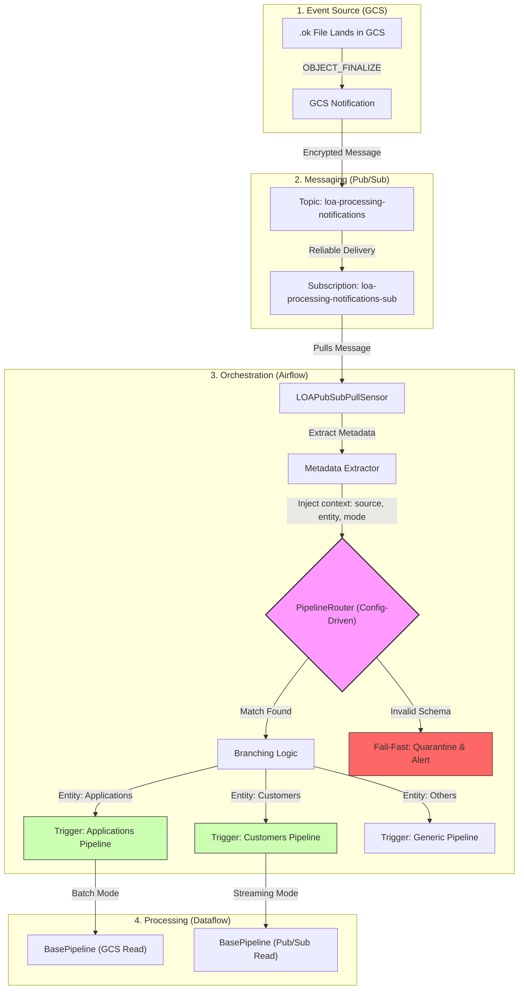

# 📊 Intelligent Routing & Orchestration Flow

This document contains the architectural flow for the generic event-driven routing engine. The diagram below uses **Mermaid.js** syntax, which is natively supported by Confluence (via the Mermaid macro) and GitHub.

## 🔄 Architectural Flow Diagram

## 🧩 Flow Description

1.  **GCS Event**: A control file (`.ok`) lands in the landing bucket, triggering a `google_storage_notification`.
2.  **Messaging**: A CMEK-encrypted message is published to Pub/Sub.
3.  **Sensor & Extraction**: The `LOAPubSubPullSensor` in Airflow picks up the message and extracts metadata (file path, entity type, etc.) into the `loa_metadata` XCom.
4.  **Intelligent Routing**: The `PipelineRouter` reads a YAML configuration and determines the correct target pipeline. It also performs a "pre-flight" check on the file structure.
5.  **Branching**: The `BranchPythonOperator` (or Trigger mechanism) routes the workflow to the specific entity-based Dataflow job.
6.  **Unified Processing**: The `BasePipeline` (from the library) executes the business logic in either Batch or Streaming mode based on the router's decision.

## 📋 Confluence Integration
To add this to Confluence:
1.  Install/Enable the **Mermaid Charts** macro.
2.  Insert the macro into your page.
3.  Copy and paste the Mermaid code block above into the macro editor.
