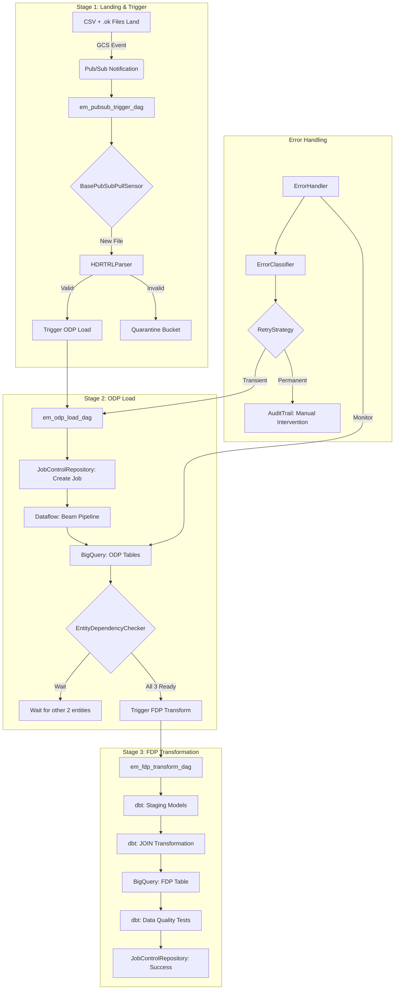

# EM Deployment

**Excess Management (EM)** data migration pipeline.

**Status:** ⚠️ In Progress | ~100 tests

---

## Overview

| Attribute | Value |
|-----------|-------|
| **System ID** | EM |
| **Source Entities** | 3 (Customers, Accounts, Decision) |
| **ODP Tables** | 3 (`odp_em.customers`, `odp_em.accounts`, `odp_em.decision`) |
| **FDP Tables** | 1 (`fdp_em.em_attributes`) |
| **Transformation** | JOIN 3 sources → 1 target |
| **Dependency** | Wait for all 3 entities before FDP |

---

## File Format

```
HDR|EM|{Entity}|{YYYYMMDD}
{csv_header_row}
{data_rows...}
TRL|RecordCount={n}|Checksum={hash}
```

**Example (Customers):**
```
HDR|EM|Customers|20260101
customer_id,name,email,status,created_date
CUST001,John Doe,john@example.com,ACTIVE,2025-01-15
CUST002,Jane Smith,jane@example.com,ACTIVE,2025-01-14
TRL|RecordCount=2|Checksum=abc123
```

---

## Data Flow

```
                         ┌─────────────────────┐
                         │ EntityDependency    │
                         │ Checker (Wait)      │
                         └──────────┬──────────┘
                                    │
    ┌───────────────────────────────┼───────────────────────────────┐
    │                               │                               │
    ▼                               ▼                               ▼
┌─────────┐                   ┌─────────┐                   ┌─────────┐
│Customers│                   │Accounts │                   │Decision │
│  (ODP)  │                   │  (ODP)  │                   │  (ODP)  │
└────┬────┘                   └────┬────┘                   └────┬────┘
     │                              │                              │
     └──────────────────────────────┼──────────────────────────────┘
                                    │
                                    ▼
                            ┌───────────────┐
                            │  dbt JOIN     │
                            │ Transformation│
                            └───────┬───────┘
                                    │
                                    ▼
                            ┌───────────────┐
                            │ em_attributes │
                            │    (FDP)      │
                            └───────────────┘
```

---

## End-to-End Operational Flow

The EM pipeline follows a standardized event-driven flow using shared library components, specifically implementing the **JOIN** pattern (3 sources → 1 target).

### 1. File Landing & Trigger (Stage 1)
- **Source**: Mainframe extract files (CSV) and trigger files (`.ok`) land in `gs://{project}-em-landing`.
- **DAG**: `em_pubsub_trigger_dag`
- **Library Components**:
    - `BasePubSubPullSensor`: Listens for `.ok` file notifications via Pub/Sub.
    - `HDRTRLParser`: Reads the `.ok` file, extracts metadata, and validates the corresponding data file's HDR and TRL records.
- **Outcome**: If valid, metadata (entity, extract date, file path) is passed to the next stage. If invalid, the file is moved to the error bucket.

### 2. ODP Load (Stage 2)
- **Trigger**: Automated trigger from Stage 1.
- **DAG**: `em_odp_load_dag`
- **Library Components**:
    - `JobControlRepository`: Creates a job record in BigQuery to track the lifecycle of this specific run.
    - `PipelineJob`: Represents the individual load task.
- **Action**: Executes a Dataflow Flex Template (Beam pipeline) to load raw CSV data into 1:1 BigQuery ODP tables (`odp_em.customers`, `odp_em.accounts`, or `odp_em.decision`).
- **Dependency Check**: Uses `EntityDependencyChecker` to verify if all 3 required entities for EM (Customers, Accounts, Decision) have been loaded for the current extract date.

### 3. FDP Transformation (Stage 3)
- **Trigger**: Triggered by Stage 2 once `EntityDependencyChecker` returns `True`.
- **DAG**: `em_fdp_transform_dag`
- **Library Components**:
    - `JobControlRepository`: Updates the status of the overall EM processing job.
- **Action**: Runs `dbt` models to:
    1. Create staging views with standardized types.
    2. **JOIN** the 3 entities into a single Foundation Data Product: `fdp_em.em_attributes`.
    3. Run data quality tests on the final product.

### 4. Error Handling & Recovery
- **DAG**: `em_error_handling_dag`
- **Library Components**:
    - `ErrorHandler`: Monitors the `odp_em` dataset for validation or processing failures.
    - `ErrorClassifier`: Categorizes errors as transient or permanent.
    - `RetryStrategy`: Automatically triggers retries for transient failures.
    - `AuditTrail`: Logs all manual interventions and automated recovery attempts for compliance.

---



---

## Directory Structure

```
deployments/em/
├── src/em/
│   ├── config/
│   │   ├── __init__.py
│   │   ├── settings.py          # SYSTEM_ID="EM", datasets
│   │   └── constants.py         # Headers, allowed values
│   │
│   ├── schema/
│   │   ├── __init__.py
│   │   ├── customers.py         # CustomerSchema
│   │   ├── accounts.py          # AccountSchema
│   │   ├── decision.py          # DecisionSchema
│   │   └── registry.py          # EM_SCHEMAS
│   │
│   ├── domain/
│   │   ├── __init__.py
│   │   └── schema.py            # BigQuery schemas
│   │
│   ├── validation/
│   │   ├── __init__.py
│   │   ├── types.py             # ValidationResult
│   │   ├── file_validator.py    # HDR/TRL validation
│   │   ├── record_validator.py  # Field validation
│   │   └── validator.py         # EMValidator
│   │
│   ├── pipeline/
│   │   ├── __init__.py
│   │   ├── em_pipeline.py       # Main Beam pipeline
│   │   ├── dag_template.py      # create_em_dag()
│   │   └── transforms.py        # Beam DoFns
│   │
│   ├── orchestration/
│   │   └── airflow/
│   │       ├── dags/            # Airflow DAGs
│   │       ├── sensors/         # PubSub sensors
│   │       └── callbacks/       # Error handlers
│   │
│   ├── transformations/
│   │   └── dbt/
│   │       └── models/
│   │           ├── staging/em/  # stg_em_customers, etc.
│   │           └── fdp/         # em_attributes (JOIN)
│   │
│   └── schemas/                 # BigQuery JSON schemas
│       ├── odp_customers.json
│       ├── odp_accounts.json
│       ├── odp_decision.json
│       └── fdp_em_attributes.json
│
├── tests/
│   ├── unit/
│   └── integration/
├── pyproject.toml
└── README.md
```

---

## Quick Start

```bash
# Run unit tests
cd deployments/em
bash run_tests.sh

# Or with pytest directly
PYTHONPATH=src pytest tests/unit -v --ignore=tests/unit/orchestration/
```

---

## Validation

```bash
# Validate imports
python -c "
from em.config import SYSTEM_ID, REQUIRED_ENTITIES
from em.schema import EM_SCHEMAS
from em.validation import EMValidator
print('✅ All EM imports OK')
print(f'   SYSTEM_ID: {SYSTEM_ID}')
print(f'   ENTITIES: {REQUIRED_ENTITIES}')
"
```

---

## dbt Commands

```bash
# Navigate to dbt directory
cd deployments/em/transformations/dbt

# Compile models
dbt compile --select staging.em
dbt compile --select fdp.em_attributes

# Run models (JOIN: 3 sources → 1 target)
dbt run --select staging.em
dbt run --select em_attributes

# Test models
dbt test --select em_attributes
```

---

## Key Components

### Configuration

The EM deployment uses a centralized configuration in `src/em/config/settings.py`:

```python
SYSTEM_ID = "EM"
REQUIRED_ENTITIES = ["customers", "accounts", "decision"]
ODP_DATASET = "odp_em"
FDP_DATASET = "fdp_em"
```

### Validation

EM implements system-specific validation logic extending the library's `BaseValidator`:

```python
from em.validation import EMValidator

validator = EMValidator()

# Validate file structure (HDR/TRL)
result = validator.validate_file(file_lines, "customers")

# Validate records against schema
valid, errors = validator.validate_records(records, "customers")
```

### Entity Dependency

EM uses the library's `EntityDependencyChecker` to implement the **JOIN** pattern, ensuring the FDP transformation only runs when all required source entities are available for the same extract date.

```python
from gcp_pipeline_builder.orchestration import EntityDependencyChecker

checker = EntityDependencyChecker(
    project_id="my-project",
    system_id="EM",
    required_entities=["customers", "accounts", "decision"],
)

if checker.all_entities_loaded(extract_date):
    # Trigger FDP transformation
    trigger_fdp()
```

---

## dbt Transformation

EM uses a **JOIN** transformation to combine 3 ODP tables into 1 FDP table. This logic is encapsulated in `transformations/dbt/models/fdp/em_attributes.sql`:

```sql
SELECT
    c.customer_id,
    c.name,
    c.status,
    a.account_id,
    a.account_type,
    a.balance,
    d.decision_id,
    d.decision_code,
    d.score
FROM {{ ref('stg_em_customers') }} c
LEFT JOIN {{ ref('stg_em_accounts') }} a
    ON c.customer_id = a.customer_id
LEFT JOIN {{ ref('stg_em_decision') }} d
    ON c.customer_id = d.customer_id
```

---

## Key Difference from LOA

| Aspect | EM | LOA |
|--------|-----|-----|
| Entities | 3 | 1 |
| Dependency | Wait for all | Immediate |
| FDP Transformation | JOIN (3→1) | SPLIT (1→2) |
| EntityDependencyChecker | Required | Not needed |

## Creating a New Deployment

See the [Creating a New Deployment Guide](../../docs/CREATING_NEW_DEPLOYMENT_GUIDE.md) for detailed steps on setting up a new pipeline.

---

## Library Components Used

| Component | Purpose |
|-----------|---------|
| `HDRTRLParser` | Parse header/trailer records |
| `validate_record_count` | Verify TRL count matches |
| `validate_checksum` | Verify data integrity |
| `EntityDependencyChecker` | Wait for all 3 entities |
| `JobControlRepository` | Track pipeline runs |
| `BasePipeline` | Beam pipeline base class |
| `DAGFactory` | Generate Airflow DAGs |

