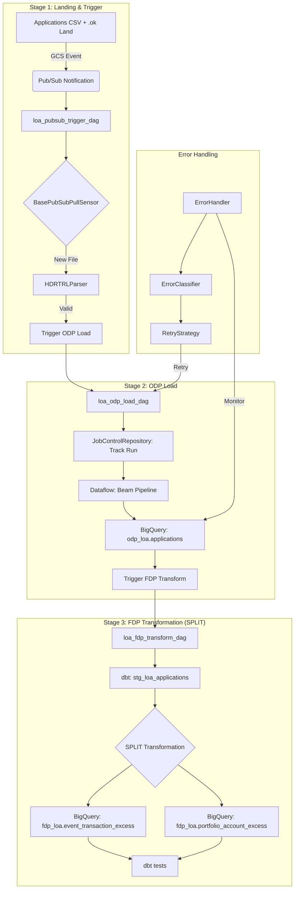

# LOA Deployment

**Loan Origination Application (LOA)** data migration pipeline.

**Status:** ✅ Complete | 55 tests passing

---

## Overview

| Attribute | Value |
|-----------|-------|
| **System ID** | LOA |
| **Source Entities** | 1 (Applications) |
| **ODP Tables** | 1 (`odp_loa.applications`) |
| **FDP Tables** | 2 (`fdp_loa.event_transaction_excess`, `fdp_loa.portfolio_account_excess`) |
| **Transformation** | SPLIT 1 source → 2 targets |
| **Dependency** | No wait - immediate trigger after ODP load |

---

## File Format

```
HDR|LOA|Applications|{YYYYMMDD}
{csv_header_row}
{data_rows...}
TRL|RecordCount={n}|Checksum={hash}
```

**Example (Applications):**
```
HDR|LOA|Applications|20260101
application_id,customer_id,amount,status,application_date
APP001,CUST001,50000.00,APPROVED,2025-12-15
APP002,CUST002,75000.00,PENDING,2025-12-16
TRL|RecordCount=2|Checksum=def456
```

---

## Data Flow



## End-to-End Operational Flow

The LOA pipeline follows a standardized event-driven flow using shared library components, specifically implementing the **SPLIT** pattern (1 source → 2 targets).

### 1. File Landing & Trigger (Stage 1)
- **Source**: Mainframe extract files (CSV) and trigger files (`.ok`) land in `gs://{project}-loa-landing`.
- **DAG**: `loa_pubsub_trigger_dag`
- **Library Components**:
    - `BasePubSubPullSensor`: Listens for `.ok` file notifications via Pub/Sub.
    - `HDRTRLParser`: Reads the `.ok` file, extracts metadata, and validates the corresponding data file's HDR and TRL records.
- **Outcome**: If valid, metadata (entity, extract date, file path) is passed to the next stage. If invalid, the file is moved to the error bucket.

### 2. ODP Load (Stage 2)
- **Trigger**: Automated trigger from Stage 1.
- **DAG**: `loa_odp_load_dag`
- **Library Components**:
    - `JobControlRepository`: Creates a job record in BigQuery to track the lifecycle of this specific run.
    - `PipelineJob`: Represents the individual load task.
- **Action**: Executes a Dataflow Flex Template (Beam pipeline) to load raw CSV data into a 1:1 BigQuery ODP table (`odp_loa.applications`).
- **Immediate Trigger**: Unlike EM, LOA does not use `EntityDependencyChecker` as it has no multi-entity dependencies; it triggers Stage 3 immediately upon successful ODP load.

### 3. FDP Transformation (Stage 3)
- **Trigger**: Automated trigger from Stage 2.
- **DAG**: `loa_fdp_transform_dag`
- **Library Components**:
    - `JobControlRepository`: Updates the status of the overall LOA processing job.
- **Action**: Runs `dbt` models to:
    1. Create staging views with standardized types.
    2. **SPLIT** the single source entity into two Foundation Data Products: `fdp_loa.event_transaction_excess` and `fdp_loa.portfolio_account_excess`.
    3. Run data quality tests on the final products.

### 4. Error Handling & Recovery
- **DAG**: `loa_error_handling_dag`
- **Library Components**:
    - `ErrorHandler`: Monitors the `odp_loa` dataset for validation or processing failures.
    - `ErrorClassifier`: Categorizes errors as transient or permanent.
    - `RetryStrategy`: Automatically triggers retries for transient failures.
    - `AuditTrail`: Logs all manual interventions and automated recovery attempts for compliance.

---

```
                    ┌─────────────────┐
                    │  LOA Extract    │
                    │  (Applications) │
                    └────────┬────────┘
                             │
                             ▼
                    ┌─────────────────┐
                    │    ODP Load     │
                    │ (Beam/Dataflow) │
                    └────────┬────────┘
                             │
                             │  odp_loa.applications
                             │
                             ▼
            ┌────────────────────────────────┐
            │      dbt Transformation        │
            │           (SPLIT)              │
            │                                │
            │    ┌──────────┴──────────┐    │
            │    ▼                     ▼    │
            │ ┌────────────┐  ┌────────────┐│
            │ │event_      │  │portfolio_  ││
            │ │transaction_│  │account_    ││
            │ │excess      │  │excess      ││
            │ └────────────┘  └────────────┘│
            └────────────────────────────────┘
```

---

## Directory Structure

```
deployments/loa/
├── src/loa/
│   ├── config/
│   │   ├── __init__.py
│   │   ├── settings.py          # SYSTEM_ID="LOA", datasets
│   │   └── constants.py         # Headers, allowed values
│   │
│   ├── schema/
│   │   ├── __init__.py
│   │   ├── applications.py      # ApplicationsSchema
│   │   └── registry.py          # LOA_SCHEMAS
│   │
│   ├── domain/
│   │   ├── __init__.py
│   │   └── schema.py            # BigQuery schemas
│   │
│   ├── validation/
│   │   ├── __init__.py
│   │   ├── types.py             # ValidationResult
│   │   ├── file_validator.py    # HDR/TRL validation
│   │   ├── record_validator.py  # Field validation
│   │   └── validator.py         # LOAValidator
│   │
│   ├── pipeline/
│   │   ├── __init__.py
│   │   ├── loa_pipeline.py      # Main Beam pipeline
│   │   ├── dag_template.py      # create_loa_dag()
│   │   └── transforms.py        # Beam DoFns
│   │
│   ├── orchestration/
│   │   └── airflow/
│   │       ├── dags/            # Airflow DAGs
│   │       ├── sensors/         # PubSub sensors
│   │       └── callbacks/       # Error handlers
│   │
│   ├── transformations/
│   │   └── dbt/
│   │       └── models/
│   │           ├── staging/loa/ # stg_loa_applications
│   │           └── fdp/         # 2 targets (SPLIT)
│   │
│   └── schemas/                 # BigQuery JSON schemas
│       ├── odp_loa_applications.json
│       ├── fdp_loa_event_transaction_excess.json
│       └── fdp_loa_portfolio_account_excess.json
│
├── tests/
│   ├── unit/                # Unit tests
│   └── data/                # Test data files
├── pyproject.toml
└── README.md
```

---

## Quick Start

```bash
# Run tests
cd deployments/loa
bash run_tests.sh

# Or with pytest directly
PYTHONPATH=src pytest tests/unit -v
```

---

## Validation

```bash
# Validate imports
python -c "
from loa.config import SYSTEM_ID
from loa.schema import LOA_SCHEMAS
from loa.validation import LOAValidator
print('✅ All LOA imports OK')
print(f'   SYSTEM_ID: {SYSTEM_ID}')
"
```

---

## dbt Commands

```bash
# Navigate to dbt directory
cd deployments/loa/transformations/dbt

# Compile models
dbt compile --select staging
dbt compile --select fdp

# Run models (SPLIT: 1 source → 2 targets)
dbt run --select stg_loa_applications
dbt run --select event_transaction_excess
dbt run --select portfolio_account_excess

# Test models
dbt test
```

---

## Key Difference from EM

| Aspect | EM | LOA |
|--------|-----|-----|
| Entities | 3 | 1 |
| Dependency | Wait for all | Immediate |
| FDP Transformation | JOIN (3→1) | SPLIT (1→2) |
| EntityDependencyChecker | Required | Not needed |

---

## Library Components Used

| Component | Purpose |
|-----------|---------|
| `HDRTRLParser` | Parse header/trailer records |
| `validate_record_count` | Verify TRL count matches |
| `validate_checksum` | Verify data integrity |
| `JobControlRepository` | Track pipeline runs |
| `BasePipeline` | Beam pipeline base class |
| `DAGFactory` | Generate Airflow DAGs |

