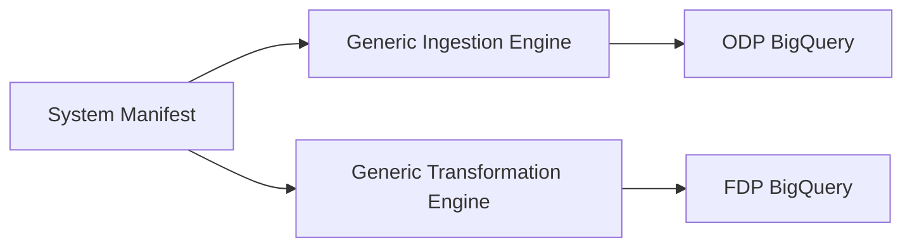

# Modularisation & Configuration Roadmap: The "Generic Engine" Model

This roadmap defines how to transition the framework from system-specific code to a **Configuration-First Deployment Model**. By assuming the libraries are separated, we can treat Ingestion and Transformation as "Generic Engines" that are controlled by external manifests.

---

## 1. The Vision: Manifest-Driven Deployments

In the current model, a new system requires a new code repository. In the **Generic Engine Model**, a new system only requires a new entry in a **System Manifest (YAML/JSON)**.



---

## 2. Configurable Ingestion (The "Universal Loader")

Instead of separate ingestion deployments per system, we deploy a single **Universal Ingestion Unit**.

### How it works:
1.  **Generic Flex Template**: We build one Dataflow Flex Template that contains the entire ingestion logic (HDR/TRL validation, PII masking, etc.).
2.  **Runtime Parameters**: When Airflow triggers the job, it passes:
    *   `--schema_config_path`: Path to a GCS JSON file defining the table structure and PII rules.
    *   `--system_id`: Used for logging and metadata.
3.  **Dynamic Schema Loading**: The Beam pipeline loads the schema at runtime using the `gcp-pipeline-core` library.

**Benefit**: Zero new code for 90% of new ingestion streams.

---

## 3. Configurable Transformation (The "dbt Factory")

Instead of separate dbt projects, we use a single **Enterprise Transformation Project** that is dynamically scoped.

### How it works:
1.  **Generic Models**: We build dbt models that use `{{ var('...') }}` for everything (source table, target table, transformations).
2.  **Dynamic Selectors**: Airflow triggers dbt using specific selectors:
    ```bash
    dbt run --select tag:{{ system_id }} --vars '{...}'
    ```
3.  **Shared Macro Library**: All complex logic (Masking, Audit) is moved to the `gcp-pipeline-transform` library, so the dbt models are just thin shells over the configuration.

---

## 4. Configurable Orchestration (The "DAG Factory")

Airflow becomes a "No-Code" environment for data engineers.

### How it works:
1.  **Single DAG File**: A single Python file in Airflow iterates over a folder of **YAML System Definitions**.
2.  **YAML Definition Example**:
    ```yaml
    system_id: "generic"
    entities:
      - name: "customers"
        type: "MAP"
        ingestion_config: "gs://config/generic/customers.json"
    ```
3.  **Automatic Generation**: Airflow automatically creates the Trigger, Load, and Transform DAGs based on this YAML.

---

## 5. Implementation Roadmap

| Phase | Goal | Key Action |
| :--- | :--- | :--- |
| **Phase 1** | **Library Separation** | Publish `gcp-pipeline-*` libraries to Artifact Registry. |
| **Phase 2** | **Parameterization** | Update reference pipelines to accept `schema` as a GCS path instead of hardcoded code. |
| **Phase 3** | **Generic Deployment** | Create the first "Universal Ingestion" Flex Template. |
| **Phase 4** | **Manifest Control** | Transition system onboarding to a YAML-only process in a central `migration-manifests` repo. |
