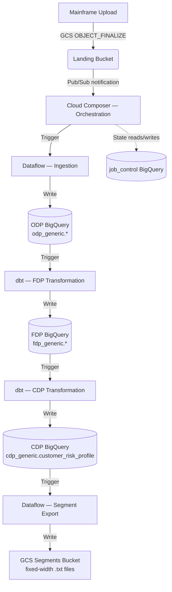

# Technical Architecture Document (TAD)

## 1. Executive Summary

This document defines the production-grade architecture for the GCP Pipeline Reference Implementation. The framework transitions legacy batch systems (mainframe extracts) into a modern, event-driven, decoupled cloud platform on Google Cloud Platform (GCP). It serves as the enterprise "Golden Path" standard for Credit Platform teams migrating mainframe data to BigQuery.

## 2. Architectural Principles

- **Decoupled Units**: Ingestion, Transformation, and Orchestration are independent deployment units with no runtime dependency on each other.
- **Metadata-Driven**: Cross-unit coordination is handled via a shared state table (`job_control`), not via hardcoded sequences or direct inter-unit calls.
- **Stateless Processing**: Ingestion and Transformation units are stateless and idempotent; re-running with the same `run_id` safely overwrites previous attempts.
- **Security by Design**: Principle of Least Privilege (PoLP) enforced through dedicated Service Accounts per unit.
- **Library-First**: All cross-cutting concerns (audit, job control, error handling, FinOps) are encapsulated in versioned libraries published to PyPI, not embedded in deployment code.

## 3. System Architecture

### 3.1 The Full Pipeline — 5 Deployment Units

The framework implements a complete mainframe-to-GCS round trip across **five deployment units** that form the Golden Path:

| # | Unit | Technology | Layer | Description |
|---|------|-----------|-------|-------------|
| 1 | **`original-data-to-bigqueryload`** | Dataflow (Beam Flex Template) | Ingest → ODP | HDR/TRL validation + raw CSV load for all entities |
| 2 | **`bigquery-to-mapped-product`** | dbt on BigQuery | ODP → FDP | JOIN + MAP transformations to Foundation Data Products |
| 3 | **`data-pipeline-orchestrator`** | Cloud Composer (Airflow) | Orchestration | Pub/Sub sensing, dependency checking, trigger coordination |
| 4 | **`fdp-to-consumable-product`** | dbt on BigQuery | FDP → CDP | Three-FDP JOIN into `cdp_generic.customer_risk_profile` |
| 5 | **`mainframe-segment-transform`** | Dataflow (Beam) | CDP → GCS | Fixed-width segment file export for mainframe consumption |

Units 1–3 are the only actively deployed units (automatically built, tested, and released by `deploy-generic.yml` on every push to `main`). Units 4 and 5 are reference/specialist deployments that complete the full round-trip back to mainframe segment files; they are included as architectural examples but are not part of the standard CI/CD pipeline.

### 3.2 Component Interaction Map



**Full end-to-end flow:**

```
Mainframe CSV files
       │  GCS landing bucket + .ok trigger file
       ▼
[data-pipeline-orchestrator]  ← Unit 3: Airflow on Cloud Composer
  PubSubPullSensor → validates .ok file → triggers Dataflow
       │
       ▼
[original-data-to-bigqueryload]  ← Unit 1: Dataflow Flex Template
  HDR/TRL validation → schema check → odp_generic.{customers,accounts,decision,applications}
       │
       ▼
[bigquery-to-mapped-product]  ← Unit 2: dbt
  JOIN: customers + accounts + decision → fdp_generic.event_transaction_excess
  MAP:  decision                        → fdp_generic.portfolio_account_excess
  MAP:  applications                    → fdp_generic.portfolio_account_facility
       │
       ▼
[fdp-to-consumable-product]  ← Unit 4: dbt
  3-FDP JOIN → cdp_generic.customer_risk_profile  (segment classification)
       │
       ▼
[mainframe-segment-transform]  ← Unit 5: Dataflow Beam
  Read CDP → format 200-char fixed-width lines → GCS segments bucket
       │
       ▼
gs://{PROJECT_ID}-generic-{ENV}-segments/
  ACTIVE_APPROVED / DECLINED / REFERRED / PENDING segment files
```

---

## 4. Data Architecture

### 4.1 Metadata Contract (`run_id`)

The `run_id` is the primary correlation key for pipeline coordination. It is generated by the Orchestration unit and propagated across all layers — Dataflow job parameters, BigQuery audit columns, and dbt run metadata.

### 4.2 Job Control Schema (`job_control.pipeline_jobs`)

This table manages the state machine for every pipeline run. Schema is owned by `JobControlRepository` in `gcp-pipeline-core`.

| Column | Type | Mode | Description |
|--------|------|------|-------------|
| `run_id` | STRING | REQUIRED | Unique correlation ID |
| `system_id` | STRING | REQUIRED | Source system identifier (e.g., `generic`) |
| `entity_type` | STRING | REQUIRED | Entity being processed (e.g., `customers`, `accounts`) |
| `extract_date` | DATE | NULLABLE | Source file extract date from HDR record |
| `status` | STRING | REQUIRED | `PENDING`, `RUNNING`, `SUCCESS`, `FAILED`, `QUARANTINED` |
| `source_files` | ARRAY\<STRING\> | REPEATED | GCS file paths processed in this run |
| `total_records` | INT64 | NULLABLE | Total records written to ODP |
| `started_at` | TIMESTAMP | NULLABLE | Pipeline start time |
| `completed_at` | TIMESTAMP | NULLABLE | Successful completion time |
| `failed_at` | TIMESTAMP | NULLABLE | Failure timestamp |
| `error_code` | STRING | NULLABLE | Standardised failure code |
| `error_message` | STRING | NULLABLE | Human-readable failure description |
| `failure_stage` | STRING | NULLABLE | Stage where failure occurred (e.g., `VALIDATION`, `LOAD`) |
| `error_file_path` | STRING | NULLABLE | GCS path to the quarantined/error file |
| `created_at` | TIMESTAMP | NULLABLE | Record creation time |
| `updated_at` | TIMESTAMP | NULLABLE | Last status update time |

### 4.3 Audit Trail Schema (`job_control.audit_trail`)

Stores `AuditRecord` events published by `gcp-pipeline-core.audit.AuditPublisher`. Records are also streamed to Pub/Sub (`generic-pipeline-events`) for real-time observability.

| Column | Type | Description |
|--------|------|-------------|
| `run_id` | STRING | Correlation ID |
| `pipeline_name` | STRING | Pipeline name |
| `entity_type` | STRING | Entity type (e.g., `customers`) |
| `source_file` | STRING | GCS path of source file |
| `record_count` | INTEGER | Total records processed |
| `processed_timestamp` | TIMESTAMP | When processing completed (partition column) |
| `processing_duration_seconds` | FLOAT | End-to-end duration |
| `success` | BOOLEAN | Whether processing succeeded |
| `error_count` | INTEGER | Records routed to DLQ |
| `audit_hash` | STRING | SHA-256 hash for tamper detection |

### 4.4 Data Layers

| Layer | Dataset | Description | Deployed by |
|-------|---------|-------------|-------------|
| **ODP** (Original Data Product) | `odp_generic` | 1:1 raw copy of mainframe data. Audit columns `_run_id`, `_source_file`, `_processed_ts`, `_extract_date`. Append-only, partitioned by `_extract_date`. | Unit 1 — `original-data-to-bigqueryload` |
| **FDP** (Foundation Data Product) | `fdp_generic` | Business-ready, joined/mapped models. Includes `_run_id` and `_transformed_ts` for full lineage. Three tables: `event_transaction_excess`, `portfolio_account_excess`, `portfolio_account_facility`. | Unit 2 — `bigquery-to-mapped-product` |
| **CDP** (Consumable Data Product) | `cdp_generic` | Denormalised view per customer joining all three FDP tables. One row per `customer_id + extract_date`. Drives the outbound segment export. | Unit 4 — `fdp-to-consumable-product` |
| **Segments** (GCS export) | GCS bucket `*-segments` | Fixed-width 200-char mainframe segment files, one file set per CDP segment category (`ACTIVE_APPROVED`, `DECLINED`, `REFERRED`, `PENDING`). | Unit 5 — `mainframe-segment-transform` |

#### CDP table: `cdp_generic.customer_risk_profile`

| Source FDP | Key Fields Brought In |
|-----------|----------------------|
| `event_transaction_excess` | `customer_id`, `account_id`, `current_balance`, `customer_status`, `ssn_masked` |
| `portfolio_account_excess` | `decision_id`, `decision_outcome`, `decision_code`, `risk_score`, `decision_reason` |
| `portfolio_account_facility` | `application_id`, `loan_amount`, `interest_rate`, `term_months`, `facility_status` |

Derived field `cdp_segment`:
- `ACTIVE_APPROVED` — decision approved and positive balance
- `DECLINED` — decision declined
- `REFERRED` — decision referred for manual review
- `PENDING` — no decision recorded yet

---

## 5. Technical Implementation (Proof of Design)

### 5.1 Orchestration Strategy (Multi-DAG Pattern)

Instead of a single monolithic DAG, each system's scheduling is split into smaller, focused DAGs.

#### 5.1.1 The DAG Roles

1. **Trigger DAG**: Listens for `.ok` file notifications via `PubSubPullSensor`. Validates the file envelope (HDR/TRL), runs data quality checks, then starts the Load stage.
2. **Load DAG**: Manages data ingestion. Updates job status (`PENDING → RUNNING → SUCCESS`) and ensures data is loaded to the ODP layer via a Dataflow Flex Template.
3. **Transform DAG**: Runs dbt transformations to create the FDP layer. Only starts after the Load DAG completes successfully and — for the JOIN pattern — after all required entities are loaded.
4. **Consumable DAG**: Triggers `fdp-to-consumable-product` (dbt) to build `cdp_generic.customer_risk_profile` from all three FDP tables, then triggers `mainframe-segment-transform` (Dataflow) to write fixed-width segment files to GCS.

#### 5.1.2 Why Separate DAGs?

| Consideration | Single Large DAG | Multiple Focused DAGs |
| :--- | :--- | :--- |
| **Failure Isolation** | A failure in one stage may require re-running everything. | Failures are contained — retry transformation without re-ingesting data. |
| **Cost** | Keeps resources active while waiting between stages. | Fire-and-forget triggers use resources only when work is available. |
| **Scaling** | Hard to manage when one DAG handles many entities. | Each DAG is independent and can be retried or backfilled individually. |
| **Maintenance** | Large monolithic files are difficult to test and update. | Smaller, focused files are easier to maintain and reason about. |
| **Coordination** | Implicit, sequential. | Explicit, state-driven via `job_control` table. |

### 5.2 Ingestion (Unit 1 — `original-data-to-bigqueryload`)

- **Technology**: Apache Beam on Cloud Dataflow (Flex Template).
- **Split File Handling**: The `file_management` module automatically detects all file splits for a given entity when the `.ok` signal file arrives, using pattern-based GCS discovery.
- **Validation**: Uses `HDRTRLParser` for envelope validation and `SchemaValidateRecordDoFn` for record-level integrity before writing to ODP. Invalid records are sent to a Dead Letter Queue (DLQ) side output rather than failing the entire job.
- **Resource Configuration**: Automatic worker type and memory configuration based on file size. See [BEAM_FILE_PROCESSING_GUIDE.md](BEAM_FILE_PROCESSING_GUIDE.md) for sizing guidelines.

### 5.3 Transformation (Unit 2 — `bigquery-to-mapped-product`)

- **Technology**: dbt on BigQuery.
- **Pattern**: Push-down SQL — all transformation logic executes within BigQuery.
- **Audit**: Shared macros from `gcp-pipeline-transform` inject `_run_id` and `_transformed_at` tracking into every FDP row, ensuring 100% lineage from source to target.

---

## 6. Pipeline Design & Flow

### 6.1 Event-Driven Lifecycle

The pipeline follows a strict reactive pattern:

1. **Event**: Mainframe uploads `.csv` splits and a final `.ok` file to the GCS landing bucket.
2. **Detection**: GCS sends `OBJECT_FINALIZE` notification → Pub/Sub topic `generic-file-notifications`.
3. **Orchestration**: Cloud Composer `PubSubPullSensor` picks up the message; filters for `.ok` files only.
4. **Validation**: Trigger DAG validates the file envelope (HDR/TRL) and runs data quality checks.
5. **Execution**: Load DAG triggers Dataflow Flex Template → Beam pipeline loads to ODP. After successful ODP load, Transform DAG triggers dbt → FDP.

### 6.2 The Two Pipeline Patterns

The Generic system proves two distinct orchestration patterns simultaneously:

#### JOIN Pattern (from Excess Management)

All 3 entities (Customers, Accounts, Decision) must reach `SUCCESS` in `job_control` for the same `extract_date` before the FDP transformation is triggered. The `EntityDependencyChecker` in `gcp-pipeline-orchestration` polls the `job_control` table to detect completion.

```
Customers ODP Load ──┐
Accounts  ODP Load ──┼──► EntityDependencyChecker ──► dbt Transform ──► FDP (2 tables)
Decision  ODP Load ──┘    (waits for all 3)
```

Produces:
- `fdp_generic.event_transaction_excess`
- `fdp_generic.portfolio_account_excess`

#### MAP Pattern (from Loan Origination)

A single entity (Applications) loads to ODP and immediately triggers dbt transformation. No dependency wait is required.

```
Applications ODP Load ──► dbt Transform ──► FDP (1 table)
             (immediate)
```

Produces:
- `fdp_generic.portfolio_account_facility`

### 6.3 State Management (Job Control)

The `job_control` table is the coordination layer. DAGs do not pass data between themselves; they pass only the `run_id`. Each DAG queries `job_control` to determine the current state before proceeding, making the system resilient to restarts and partial failures.

---

## 7. Security Architecture

### 7.1 Identity & Access Management (IAM)

Each unit runs with its own dedicated Service Account:

- `generic-dataflow-sa`: Storage Object Reader, BigQuery Data Editor.
- `generic-dbt-sa`: BigQuery Job User, BigQuery Data Editor.
- `generic-composer-sa`: Dataflow Admin, BigQuery User, Storage Object Admin.

### 7.2 Data Protection

- **Encryption at Rest**: All data encrypted with Google-managed keys (CMEK-ready).
- **In Transit**: Pub/Sub notifications and GCS transfers encrypted via TLS 1.2.
- **Network**: VPC Service Controls (VPC-SC) compatible.

---

## 8. Operational Patterns

### 8.1 Error Handling & Recovery

- **Transient Errors**: Automated exponential backoff at the Airflow task level.
- **Fatal Errors**: `JobControlRepository.mark_failed()` captures error code, message, and file path for manual recovery.
- **Replayability**: Pipelines are idempotent; re-running with the same `run_id` safely overwrites previous attempts. Use `_run_id` to clean up partial data:
  ```sql
  DELETE FROM `odp_generic.customers` WHERE _run_id = 'failed_run_id';
  ```

### 8.2 Monitoring & Observability

- **Logging**: Structured JSON logging in all libraries, searchable in Cloud Logging.
- **Tracing**: `run_id` used as correlation ID across Cloud Logging, Dataflow, and BigQuery.
- **Metrics**: Custom metrics exported to Cloud Monitoring and Dynatrace via `gcp-pipeline-core`.
- **Dashboards**: Pre-configured Cloud Monitoring dashboards for pipeline throughput, error rates, and FinOps costs.

---

## 9. Technical Considerations

### 9.1 Airflow Performance on Cloud Composer

- **Parsing Overhead**: Multiple focused DAGs are individually faster to parse than a single monolithic DAG, resulting in a more responsive Airflow Scheduler and UI.
- **Worker Slots**: Using `reschedule` mode for Sensors and fire-and-forget triggers minimises the time a DAG occupies a worker slot, reducing Cloud Composer costs.

### 9.2 Cross-DAG Coordination

- **TriggerDagRunOperator**: Used for direct 1:1 downstream triggers (e.g., MAP pattern: ODP load complete → immediately trigger transformation).
- **Job Control Polling**: Used for complex join dependencies. The `EntityDependencyChecker` queries `job_control` to confirm all required entities for a given `extract_date` have reached `SUCCESS` before triggering transformation. This is more robust than `ExternalTaskSensor`, which is coupled to specific execution times.

### 9.3 Shared-Nothing at Runtime

The 3-unit model enforces a Shared-Nothing architecture at runtime. The Ingestion unit has no knowledge of Airflow; the Orchestration unit has no knowledge of Beam. This enables:

- **Independent Upgrades**: Upgrade the Beam SDK without affecting Airflow compatibility.
- **Polyglot Teams**: One team can own the Beam ingestion while another owns the dbt transformation, with no shared runtime dependencies.

---

## 10. Pluggable & Hybrid Architecture

The framework is designed as a Pluggable Architecture. While it provides reference implementations for Ingestion (Beam) and Transformation (dbt), these can be replaced by alternative tools without redesigning the Orchestration or Audit layers — as long as the Metadata Contract is respected.

### 10.1 Handling Diverse Sources (Spanner, Teradata, etc.)

#### Pattern A: Federated Transformation (dbt + External Queries)

Best for: Low-to-medium volume where BigQuery can query Spanner directly.

1. Airflow triggers dbt (Unit 2).
2. dbt models use `EXTERNAL_QUERY` to pull from Spanner and transform directly into BigQuery FDP tables.
3. `gcp-pipeline-transform` macros inject `run_id` and `_transformed_at` timestamps.

#### Pattern B: Two-Step Migration (Ingestion + Transformation)

Best for: High-volume data, complex pre-processing, or isolation from source system performance.

1. A Beam pipeline reads from Cloud Spanner at scale and writes to BigQuery ODP.
2. Standard dbt models transform from ODP to FDP.
3. Airflow coordinates both steps via the `job_control` table.

### 10.2 The Metadata Contract as the Integration Point

Any tool that respects the Metadata Contract (accepts `run_id`, updates `job_control`, populates `_run_id` audit columns) can be integrated into the pipeline.

```
      ORCHESTRATION UNIT (Cloud Composer / Airflow)
      ─────────────────────────────────────────────
             │                    │
      ┌──────┴──────┐      ┌──────┴──────┐
      ▼             ▼      ▼             ▼
  REFERENCE     IN-HOUSE  REFERENCE  IN-HOUSE
  INGESTION     INGESTION TRANSFORM  TRANSFORM
  (Beam)        (Tool X)  (dbt)      (Tool Y)
```

### 10.3 Integrating In-House Ingestion

To replace the Beam ingestion with an in-house tool:

1. **Accept `run_id`**: The tool must accept a `run_id` as a parameter.
2. **Audit Columns**: Populate `_run_id` and `_processed_ts` in the target ODP table.
3. **State Management**: Update `job_control` status using `JobControlRepository`.

```python
# Example: Replacing Dataflow with an in-house Spark job
run_in_house_ingestion = SparkSubmitOperator(
    task_id='run_ingestion',
    application='gs://code-bucket/ingest.py',
    conf={'run_id': "{{ ti.xcom_pull(key='run_id') }}"}
)
```

### 10.4 Integrating In-House Transformation

To replace dbt with BigQuery Stored Procedures:

1. **Filter by `run_id`**: Ensure exactly-once processing by filtering source ODP data using `_run_id`.
2. **Audit Persistence**: Ensure FDP tables still contain `_run_id` and `_transformed_at`.

```python
# Example: Replacing dbt with a BigQuery Stored Procedure
run_sproc = BigQueryValueCheckOperator(
    task_id='run_transform',
    sql="CALL `my_project.my_dataset.transform_data`('{{ ti.xcom_pull(key=\"run_id\") }}')",
    use_legacy_sql=False
)
```

### 10.5 The Essential Role of the Core Library in Hybrid Scenarios

Even when the reference Ingestion or Transformation units are replaced, `gcp-pipeline-core` remains the **mandatory foundation** of the platform. It provides:

1. **Standardised Metadata Contract**: Shared data models (`PipelineJob`, `AuditRecord`) used by the `job_control` table. Without these, in-house tools would break cross-unit coordination.
2. **Unified State Management**: `JobControlRepository` provides a standardised way to update pipeline status (`PENDING → RUNNING → SUCCESS`), ensuring correct participation in the platform's state machine.
3. **End-to-End Observability**: Structured JSON logging and standardised metrics ensure that logs from any tool are searchable and alertable. The `run_id` is consistently propagated as a correlation ID.
4. **Data Integrity & Auditability**: `AuditTrail` and `ReconciliationEngine` are tool-agnostic. Integrating the core library provides source-to-target reconciliation and lineage tracking regardless of which technology performed the data movement.

### 10.6 Alignment with Enterprise Golden Paths

This framework aligns with enterprise data platform standards while providing the missing orchestration and ingestion layers.

#### Transformation (dbt on Cloud Run)

The Enterprise Transformation Golden Path enables teams to run dbt on Cloud Run. Our Orchestration Unit (Unit 3) acts as the invoker — triggering dbt only after all upstream ODP loads have successfully updated `job_control`. This prevents the partial-data problem inherent in simple time-based triggers. Teams can use the enterprise pipeline to deploy dbt code while using this framework's Airflow DAGs to trigger execution, maintaining unified `run_id` lineage.

#### Ingestion

This framework's Ingestion Unit (Unit 1 — Beam) serves as the production-ready Golden Path for mainframe-to-GCP ingestion, providing HDR/TRL validation, split-file reassembly, and ODP audit columns. Because Unit 1 is independent of Units 2 and 3, systems can migrate to an alternative ingestion implementation in future simply by swapping Unit 1.

### 10.7 Governance for Custom Golden Paths

All custom Golden Paths must adhere to the following mandatory rules to maintain platform integrity.

#### 10.7.1 Pathway to Official Golden Path Status

A custom pattern can be promoted if it:

1. **Demonstrates Reusability**: Solves a pattern common to at least two different systems.
2. **Passes Peer Review**: Reviewed and approved by the Credit Platform architecture guild.
3. **Includes Templates**: Provides scaffolding in the `templates/` directory.
4. **Maintains Documentation**: Includes comprehensive READMEs and architectural diagrams.

#### 10.7.2 Mandatory Rules

1. **Mandatory Core Integration**: Every Golden Path MUST use `gcp-pipeline-core`. It is the only source of truth for `PipelineJob` models and `AuditTrail` logic.
2. **Metadata Contract Compliance**: Every unit must accept a `run_id` as its primary correlation key and must update `job_control` state (`PENDING → RUNNING → SUCCESS/FAILED`) using `JobControlRepository`.
3. **Strict Audit Lineage**: All data written to BigQuery (ODP or FDP) MUST include `_run_id` and a processing timestamp (`_processed_ts` or `_transformed_at`).
4. **Functional Decoupling**: Ingestion logic must not be embedded in Transformation scripts; Orchestration must remain engine-agnostic.
5. **Standardised Observability**: All components must implement Structured JSON Logging and export standardised metrics as defined in `gcp-pipeline-core`.
6. **Security Isolation**: Each functional unit must run under a dedicated Service Account with PoLP permissions.

---

## 11. Summary

The framework is a production-hardened implementation of a library-first architecture. By enforcing strict decoupling through the 3-Unit Deployment model, the multi-DAG orchestration pattern, and the `job_control` metadata contract, it delivers a scalable, cost-effective, and tool-agnostic solution for enterprise mainframe-to-GCP data migrations.

---

## 12. Architectural Rationale: Why Beam & Cloud Composer?

### 12.1 What is Missed by Not Using Apache Beam (Dataflow)?

While BigQuery can load CSV files directly (`bq load`), this framework uses Beam for several critical responsibilities:

1. **Complex Envelope Validation**: Mainframe extracts contain HDR/TRL records. The `HDRTRLParser` validates these programmatically before any data is ingested. If the trailer count does not match, the pipeline fails before loading any data.
2. **Fine-Grained Record Quarantining**: `SchemaValidateRecordDoFn` inspects every record individually. Invalid records are sent to a Dead Letter Queue side output while valid records continue. `bq load` is all-or-nothing and lacks the precision required for regulated financial data.
3. **Split File Reassembly**: The `file_management` module handles files split at the 25MB threshold, reading all splits in a single parallel job with a unified `run_id`.
4. **Streaming Readiness**: The same Beam code used for batch migration can be switched to `streaming=True` for real-time delta updates without rewriting logic.

### 12.2 What is Missed by Not Using Cloud Composer (Airflow)?

Cloud Workflows is suitable for simple linear sequences, but this framework requires Composer for enterprise complexity:

1. **Complex State Coordination (JOIN Pattern)**: The JOIN pattern requires waiting for multiple independent entities before triggering transformation. The `EntityDependencyChecker` uses `job_control` to manage this cross-DAG state — a pattern significantly harder to implement and monitor in serverless workflows.
2. **Sophisticated Retry & Backoff**: Airflow's built-in exponential backoff, task-level retries, and manual "Clear" capabilities provide a robust safety net for the messy realities of legacy system extracts.
3. **The DAG Factory Model**: `DAGFactory` generates standardised DAGs from configuration, ensuring all systems follow the same operational pattern (Trigger → Load → Transform), essential for a small operations team managing a large-scale migration.
4. **Operational UI**: When a migration fails, the Airflow UI provides immediate visual feedback on exactly which task failed, XCom values (including `run_id`), and structured logs.

### 12.3 Cloud Composer vs GKE Self-Hosted Airflow

| Aspect | Cloud Composer (Managed) | GKE Self-Hosted Airflow |
| :--- | :--- | :--- |
| **Operations overhead** | Minimal — Google manages upgrades, scaling, and availability | Higher — team manages Kubernetes, Helm charts, and Airflow upgrades |
| **Cost model** | Fixed environment cost | Pay for GKE node pool; can be optimised with aggressive autoscaling |
| **Recommended use** | Primary deployment path (`deploy-generic.yml`) | Alternative pattern for teams with GKE expertise (`deploy-gke.yml`) |
| **Reference** | This repository | See [GKE Deployment Guide](./GKE_DEPLOYMENT_GUIDE.md) |

### 12.4 Summary of Trade-offs

| Aspect | Basic Cloud Tools | Framework Reference (Beam + Composer) |
| :--- | :--- | :--- |
| **Cost** | Lower (pay per run) | Higher (fixed environment cost) |
| **Parsing** | Rigid (standard files only) | Powerful (custom HDR/TRL envelopes) |
| **Validation** | Basic (type check only) | Advanced (custom rules and record quarantining) |
| **Operations** | Less visibility | Professional (visual UI, structured logs, `run_id` tracing) |
| **Scaling** | Limited by tool capacity | Virtually unlimited |

For a small, simple migration, basic tools may be sufficient. For a professional enterprise platform requiring **data integrity**, **resilience**, and **scale** across regulated financial data, the Beam and Composer stack provides the necessary guarantees.
