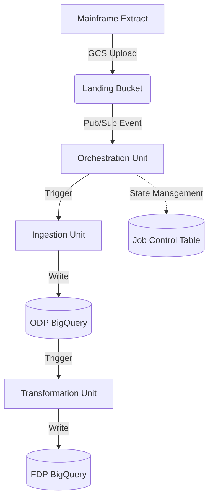

# Technical Architecture Document (TAD)

## 1. Executive Summary
This document defines the production-grade architecture for the Legacy Mainframe to GCP Data Migration Framework. It transitions legacy batch systems into a modern, event-driven, and decoupled cloud platform using Google Cloud Platform (GCP).

## 2. Architectural Principles
*   **Decoupled Units**: Ingestion, Transformation, and Orchestration are independent deployment units.
*   **Metadata-Driven**: Coordination is handled via a shared state table (`job_control`), not via hardcoded sequences.
*   **Stateless Processing**: Ingestion and Transformation units are stateless and idempotent.
*   **Security by Design**: Principle of Least Privilege (PoLP) enforced through dedicated Service Accounts.

## 3. System Architecture

### 3.1 The 3-Unit Deployment Model
Every system (e.g., EM, LOA) is implemented as three independent functional units:

1.  **Unit 1: Ingestion (Beam/Dataflow)**: Handles I/O, file validation, and raw loading.
2.  **Unit 2: Transformation (dbt/BigQuery)**: Implements business logic and data modeling.
3.  **Unit 3: Orchestration (Airflow/Composer)**: Coordinates the execution and state transitions.

### 3.2 Component Interaction Map


---

## 4. Data Architecture

### 4.1 Metadata Contract (`run_id`)
The `run_id` is the primary key for pipeline coordination. It is generated by the Orchestration unit and propagated across all layers.

### 4.2 Job Control Schema (`job_control.pipeline_jobs`)
This table manages the state machine for every migration run.

| Column | Type | Description |
|--------|------|-------------|
| `run_id` | STRING | Unique ID (Correlation ID) |
| `system_id` | STRING | Source system (EM, LOA) |
| `entity_type` | STRING | Entity (Customers, Accounts) |
| `extract_date` | DATE | Source file extract date |
| `status` | STRING | PENDING, RUNNING, SUCCESS, FAILED |
| `started_at` | TIMESTAMP | Actual start time |
| `completed_at` | TIMESTAMP | Completion time |
| `source_files` | ARRAY<STRING>| List of GCS files processed |
| `total_records` | INT64 | Record count from BigQuery |
| `error_code` | STRING | Standardized failure code |

### 4.3 Data Layers
*   **ODP (Original Data Product)**: 1:1 raw copy of mainframe data. Includes audit columns (`_run_id`, `_source_file`, `_processed_at`).
*   **FDP (Foundation Data Product)**: Business-ready, joined, and cleaned data models.

---

## 5. Technical Implementation (Proof of Design)

### 5.1 Micro-Orchestration (Multi-DAG Pattern)
Instead of a single monolithic DAG, each system's orchestration is split into three or more focused DAGs.

#### 5.1.1 The DAG Roles
1.  **Trigger DAG**: Listens for external events (e.g., Pub/Sub message for a `.ok` file). It performs lightweight validation (HDR/TRL check) and triggers the next stage.
2.  **Load DAG (ODP)**: Manages the Dataflow job. It handles job control state updates (PENDING → RUNNING → SUCCESS) and ensures data is loaded to the ODP layer.
3.  **Transform DAG (FDP)**: Executes dbt models to transform ODP data into FDP data. It is triggered only after the Load DAG succeeds.

#### 5.1.2 Why Separate DAGs?
| Consideration | Monolithic DAG | Micro-Orchestration (Multi-DAG) |
| :--- | :--- | :--- |
| **Blast Radius** | Failure in transformation might require re-running the entire DAG, risking expensive ingestion re-runs. | Failures are isolated. You can retry the Transform DAG without touching the Ingestion layer. |
| **Cost** | DAGs stay "active" while waiting for files, consuming Airflow worker slots. | Trigger DAGs are "fire-and-forget". Resources are only consumed when there is actual work. |
| **Scaling** | Hard to scale when one DAG manages hundreds of entities. | Each entity/stage is independent, allowing Airflow to schedule tasks more efficiently. |
| **Maintenance** | Massive DAG files are hard to read, test, and update. | Focused DAGs are easier to maintain and allow independent deployment of logic. |
| **Complexity** | Simple linear dependencies. | Requires a robust metadata layer (Job Control) to coordinate state across DAGs. |

### 5.2 Ingestion (Unit 1)
*   **Pattern**: Shared-Nothing Ingestion.
*   **Implementation**: Apache Beam on Cloud Dataflow.
*   **Split File Handling**: The framework automatically detects and reassembles files split at the 25MB threshold by watching for the `.ok` signal file and using pattern-based discovery.
*   **Validation**: Uses `HDRTRLParser` for envelope validation and `SchemaValidator` for record-level integrity before writing to ODP.

### 5.3 Transformation (Unit 2)
*   **Pattern**: Push-down SQL.
*   **Implementation**: dbt (data build tool).
*   **Audit**: Shared macros from `gcp-pipeline-transform` inject `run_id` tracking into every FDP row, ensuring 100% lineage from source to target.

---

## 6. Pipeline Design & Flow

### 6.1 Event-Driven Lifecycle
The pipeline follows a strict reactive pattern:
1.  **Event**: Mainframe uploads `.csv` splits and a final `.ok` file.
2.  **Detection**: GCS triggers a Pub/Sub message.
3.  **Validation**: Trigger DAG validates the file envelope (HDR/TRL).
4.  **Execution**: Load DAG runs Dataflow; Transform DAG runs dbt.

### 6.2 Idempotency and Replayability
*   **Idempotency**: Every unit is designed to be re-run safely. BigQuery `WRITE_TRUNCATE` or partition-level overwrites ensure that duplicate runs don't duplicate data.
*   **Replayability**: If a job fails at the Transform stage, an operator can simply "Clear" the Transform DAG. It will pick up the existing `run_id` from the metadata and re-process the ODP data.

### 6.3 State Management (Job Control)
The `job_control` table acts as the "Brain" of the platform. DAGs do not pass large amounts of data between themselves; instead, they pass the `run_id`. Each DAG queries the `job_control` table to understand the current state of the world before proceeding.

---

## 7. Security Architecture

### 7.1 Identity & Access Management (IAM)
Each unit runs with its own dedicated Service Account:
*   `*-dataflow-sa`: Storage Reader, BQ Editor.
*   `*-dbt-sa`: BQ Job User, BQ Editor.
*   `*-composer-sa`: Dataflow Admin, BQ User.

### 7.2 Data Protection
*   **Encryption**: All data at rest is encrypted (CMEK ready).
*   **In-Transit**: Pub/Sub notifications are encrypted via KMS.
*   **Network**: VPC Service Controls (VPC-SC) compatibility.

---

## 8. Operational Patterns

### 8.1 Error Handling & Recovery
*   **Transient Errors**: Automated exponential backoff at the task level.
*   **Fatal Errors**: `JobControlRepository.mark_failed()` captures context for manual recovery.
*   **Replayability**: Pipelines are idempotent; re-running with the same `run_id` safely overwrites previous attempts.

### 8.2 Monitoring & Observability
*   **Logging**: Structured JSON logging in all libraries.
*   **Tracing**: `run_id` used as a correlation ID across Cloud Logging, Dataflow, and BigQuery.
*   **Metrics**: Custom metrics exported to Cloud Monitoring via `gcp-pipeline-core`.

## 9. Technical Considerations

### 9.1 Airflow Performance
*   **Parsing Overhead**: While many small DAGs increase the number of files the Airflow Scheduler must parse, they are significantly faster to parse individually than a single 5,000-line monolithic DAG. This leads to a more responsive UI and more stable scheduler heartbeats.
*   **Worker Slots**: By using "fire-and-forget" triggers and Sensors in `reschedule` mode, we minimize the time a DAG occupies a worker slot, significantly reducing Cloud Composer costs.

### 9.2 Cross-DAG Coordination
*   **TriggerDagRunOperator**: Used for direct downstream triggers when the relationship is 1:1 (like in LOA).
*   **Job Control Polling**: Used for complex joins (like in EM). The `em_dependency_check_dag` queries the `job_control` table to see if all required entities for a given `extract_date` have reached the `SUCCESS` state before triggering the transformation. This is more robust than using `ExternalTaskSensor` which is tied to specific execution times.

### 9.3 Shared-Nothing vs. Shared-Everything
The 3-unit model enforces a **Shared-Nothing** architecture at the runtime level. The Ingestion unit has no knowledge of Airflow, and the Orchestration unit has no knowledge of Beam. This allows for:
*   **Independent Upgrades**: Upgrade the Beam SDK without worrying about Airflow compatibility.
*   **Polyglot Teams**: One team can use Python/Beam for ingestion while another uses SQL/dbt for transformation.

---

## 10. Pluggable & Hybrid Architecture
The framework is designed as a **Pluggable Architecture**. While it provides reference implementations for Ingestion (Beam) and Transformation (dbt), these can be replaced by in-house tools (Spark, Stored Procedures, etc.) without redesigning the Orchestration or Audit layers.

### 10.1 The Metadata Contract as the Integration Point
The 3-Unit Deployment model is decoupled via the **Metadata Contract** (`job_control` table and `run_id`). Any tool that respects this contract can be integrated into the pipeline.

```
      ORCHESTRATION UNIT (Airflow)
      ───────────────────────────
             │           │
      ┌──────┴──────┐    └──────┬──────┐
      ▼             ▼           ▼      ▼
   REFERENCE     IN-HOUSE     REFERENCE     IN-HOUSE
   INGESTION     INGESTION    TRANSFORM     TRANSFORM
   (Beam)        (Tool X)     (dbt)         (Tool Y)
```

### 10.2 Integrating In-House Ingestion
To replace the reference Beam ingestion with an in-house tool (e.g., Spark, Fivetran):
1.  **Accept `run_id`**: The tool must accept a `run_id` as a parameter.
2.  **Audit Columns**: It must populate `_run_id` and `_processed_at` in the target ODP table.
3.  **State Management**: The Airflow DAG or the tool itself must update the `job_control` table status.

**Example: Triggering in-house Ingestion from DAG**
```python
# Replacing Dataflow with an In-House Spark Job
run_in_house_ingestion = SparkSubmitOperator(
    task_id='run_ingestion',
    application='gs://code-bucket/ingest.py',
    conf={'run_id': "{{ ti.xcom_pull(key='run_id') }}"}
)
```

### 10.3 Integrating In-House Transformation
To replace dbt with BigQuery Stored Procedures or other SQL engines:
1.  **Filter by `run_id`**: Ensure exactly-once processing by filtering source ODP data using `_run_id`.
2.  **Audit Persistence**: Ensure FDP tables still contain `_run_id` and `_transformed_at`.

**Example: Triggering Stored Procedure from DAG**
```python
# Replacing dbt with a BigQuery Stored Procedure
run_sproc = BigQueryValueCheckOperator(
    task_id='run_transform',
    sql="CALL `my_project.my_dataset.transform_data`('{{ ti.xcom_pull(key=\"run_id\") }}')",
    use_legacy_sql=False
)
```

### 10.4 The Essential Role of the Core Library in Hybrid Scenarios
Even when the reference Ingestion (Beam) or Transformation (dbt) units are replaced by in-house tools, the `gcp_pipeline_core` library remains the **mandatory foundation** of the platform. It provides the cross-cutting concerns that turn a collection of individual scripts into a unified, production-grade platform.

#### 1. Standardizing the Metadata Contract
The core library defines the shared data models and schemas (e.g., `PipelineJob`, `AuditRecord`) used by the `job_control` table. Without these shared definitions, in-house tools would speak a different "language," breaking the event-driven coordination between units.

#### 2. Unified State Management
The `JobControlRepository` within the core library provides a standardized way to update pipeline status (PENDING → RUNNING → SUCCESS). By using this library, in-house tools ensure they participate correctly in the platform's state machine, allowing the Orchestration unit (Airflow) to detect completions and trigger downstream dependencies accurately.

#### 3. End-to-End Observability
The core library enforces **Structured JSON Logging** and **Standardized Metrics**. Integrating these into in-house tools ensures that logs from a Spark ingestion job or a Stored Procedure are just as searchable and alertable as those from the reference Beam pipeline. It ensures the `run_id` is consistently propagated as a correlation ID across the entire hybrid stack.

#### 4. Data Integrity & Auditability
The `AuditTrail` and `ReconciliationEngine` are tool-agnostic. By including the core library in hybrid units, teams can leverage built-in source-to-target reconciliation and lineage tracking. This provides a single source of truth for data quality and compliance, regardless of which technology performed the actual data movement.

## 11. Summary
The framework is a production-hardened implementation of a library-first architecture. By enforcing strict decoupling through the 3-Unit Deployment model, the Micro-Orchestration pattern, and the Job Control metadata contract, it delivers a scalable, cost-effective, and tool-agnostic solution for enterprise data migrations.

## 12. Architectural Rationale: Why Beam & Composer?

A common question in cloud architecture is whether "heavier" tools like Apache Beam (Dataflow) and Cloud Composer (Airflow) are necessary, or if "lighter" alternatives like BigQuery Load and Cloud Workflows would suffice. This section details why the framework chose this stack and what is "missed" if they are removed.

### 12.1 What is missed by not using Apache Beam (Dataflow)?

While BigQuery can load CSV files directly (`bq load`), the migration framework uses Beam for several critical "Unit 1" responsibilities:

1.  **Complex Envelope Validation**: Mainframe extracts are not just raw CSVs; they contain HDR/TRL (Header/Trailer) records. Beam allows the `HDRTRLParser` to validate these records *programmatically* before data ingestion. If the trailer count doesn't match, the pipeline fails before loading any data, preventing "dirty" data from entering the ODP.
2.  **Fine-Grained Record Quarantining**: `SchemaValidateRecordDoFn` allows us to inspect every single record. Invalid records are sent to a "Side Output" (Dead Letter Queue table) while valid records continue. BQ Load is "all or nothing" or relies on `max_bad_records`, which lacks the precision needed for regulated financial data.
3.  **Split File Reassembly**: Beam's `file_management` module handles files split by the mainframe at the 25MB threshold. It reads all splits in a single parallel job, maintaining a unified `run_id`.
4.  **Streaming Readiness**: The same Beam code used for batch migration can be toggled to `streaming=True` for real-time delta updates without rewriting logic.

### 12.2 What is missed by not using Cloud Composer (Airflow)?

Lightweight tools like Cloud Workflows are excellent for simple linear sequences, but the migration framework uses Composer for "Unit 3" to handle enterprise complexity:

1.  **Complex State Coordination (JOIN Pattern)**: In the EM system, we must wait for three independent entities (Customers, Accounts, Decisions) before triggering transformation. The `EntityDependencyChecker` uses the `job_control` table to manage this cross-DAG state, a pattern that is significantly harder to implement and monitor in serverless workflows.
2.  **Sophisticated Retry & Backoff**: Migration involves messy legacy systems. Airflow's built-in exponential backoff, task-level retries, and manual "Clear" capabilities provide a robust safety net that would require significant custom code in simpler tools.
3.  **The "Factory" Model**: Our `DAGFactory` generates standardized DAGs from configuration. This ensures that 50 different systems follow the exact same operational pattern (Trigger → Load → Transform), which is essential for a small operations team managing a large-scale migration.
4.  **Operational UI**: When a migration fails at 3 AM, the Airflow UI provides immediate visual feedback on exactly which task failed, XCom values (like `run_id`), and logs. This visibility is "missed" when using more opaque orchestration tools.

### 12.3 Summary of Trade-offs

| Aspect | BQ Load + Workflows | Beam + Composer (Reference) |
| :--- | :--- | :--- |
| **Cost** | Lower (Pay per run/load) | Higher (Fixed environment cost) |
| **Parsing** | Rigid (Standard CSV only) | Powerful (Custom HDR/TRL, Fixed-width) |
| **Validation** | Basic (Type check only) | Advanced (Logic, Quarantining) |
| **Ops** | Harder (Less visibility) | Professional (Visual, Detailed) |
| **Scaling** | Limited by BQ Load jobs | Virtually unlimited (Horizontal) |

**Conclusion**: For a small, self-contained migration, lightweight tools may suffice. However, for a production-grade enterprise platform that requires **data integrity (Audit)**, **resilience (Retries)**, and **scale**, the Beam and Composer stack provides the necessary "insurance" against operational failure.
