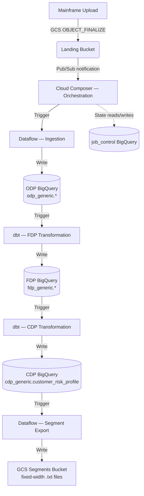

# Technical Architecture Document (TAD)

**Version:** 1.0.11
**Last Updated:** March 2026
**Author:** Lead Developer
**Status:** Living Document

---

## Table of Contents

1. [Executive Summary](#1-executive-summary)
2. [Architectural Principles](#2-architectural-principles)
3. [System Architecture](#3-system-architecture)
4. [Data Architecture](#4-data-architecture)
5. [Technical Implementation](#5-technical-implementation-proof-of-design)
6. [Pipeline Design & Flow](#6-pipeline-design--flow)
7. [Security Architecture](#7-security-architecture)
8. [Operational Patterns](#8-operational-patterns)
9. [Technical Considerations](#9-technical-considerations)
10. [Pluggable & Hybrid Architecture](#10-pluggable--hybrid-architecture)
11. [Summary](#11-summary)
12. [Architectural Rationale: Why Beam & Cloud Composer?](#12-architectural-rationale-why-beam--cloud-composer)
13. [GCP Infrastructure Topology](#13-gcp-infrastructure-topology)
14. [Non-Functional Requirements](#14-non-functional-requirements)
15. [Environment Strategy](#15-environment-strategy)
16. [Dependencies & Integration Points](#16-dependencies--integration-points)
17. [Disaster Recovery & Business Continuity](#17-disaster-recovery--business-continuity)
18. [Cost Model](#18-cost-model)

---

## 1. Executive Summary

This document defines the production-grade architecture for the GCP Pipeline Reference Implementation. The framework transitions legacy batch systems (mainframe extracts) into a modern, event-driven, decoupled cloud platform on Google Cloud Platform (GCP). It serves as the enterprise "Golden Path" standard for Credit Platform teams migrating mainframe data to BigQuery.

> **Related:** For the complete end-to-end data flow (stages, schemas, diagrams) see [E2E_FUNCTIONAL_FLOW.md](E2E_FUNCTIONAL_FLOW.md). For deployment operations see [DEPLOYMENT_OPERATIONS_GUIDE.md](DEPLOYMENT_OPERATIONS_GUIDE.md).

### 1.1 How to Read This Document

This TA describes a **reusable, system-agnostic architecture**. Any team can follow this pattern to create their own ODP and FDP data products by provisioning a new `{system_id}` (e.g., `loans`, `cards`, `payments`).

Throughout this document:
- **`{system_id}`** — the source system identifier (e.g., `generic`, `loans`)
- **`{entity}`** — a single data entity within a system (e.g., `customers`, `transactions`)
- **`{env}`** — the target environment (`int`, `prod`)

The **Generic system** (`system_id=generic`) is the reference implementation that proves both the JOIN pattern (multi-entity dependency) and the MAP pattern (single-entity). All architecture described here is system-agnostic — Generic is used only for concrete examples.

| To onboard a new system | What you create |
|------------------------|----------------|
| New ODP (per entity) | `odp_{system_id}.{entity}` table — auto-created by Beam on first write |
| New FDP (per product) | `fdp_{system_id}.{product}` table — created by dbt on first run |
| Infrastructure | New Terraform module: GCS buckets `{project}-{system_id}-{env}-*`, BigQuery datasets `odp_{system_id}` / `fdp_{system_id}`, Pub/Sub topics |
| Deployment units | 3 folders under `deployments/`: `{system_id}-ingestion`, `{system_id}-transformation`, `{system_id}-orchestration` |
| Shared library | Same `gcp-pipeline-framework` — zero new library code required |

See [CREATING_NEW_DEPLOYMENT_GUIDE.md](CREATING_NEW_DEPLOYMENT_GUIDE.md) for the step-by-step onboarding process.

## 2. Architectural Principles

- **Decoupled Units**: Ingestion, Transformation, and Orchestration are independent deployment units with no runtime dependency on each other.
- **Metadata-Driven**: Cross-unit coordination is handled via a shared state table (`job_control`), not via hardcoded sequences or direct inter-unit calls.
- **Stateless Processing**: Ingestion and Transformation units are stateless and idempotent; re-running with the same `run_id` safely overwrites previous attempts.
- **Security by Design**: Principle of Least Privilege (PoLP) enforced through dedicated Service Accounts per unit.
- **Library-First**: All cross-cutting concerns (audit, job control, error handling, FinOps) are encapsulated in versioned libraries published to PyPI, not embedded in deployment code.

## 3. System Architecture

### 3.1 The Full Pipeline — 5 Golden Path Patterns

The framework defines **five reusable deployment patterns**. Each pattern is a Golden Path that teams adopt by creating a system-specific instance:

| # | Pattern | Technology | Layer Transition | Description |
|---|---------|-----------|-----------------|-------------|
| 1 | **Ingestion** | Dataflow (Beam Flex Template) | Source → ODP | HDR/TRL validation + raw CSV load for all entities |
| 2 | **Transformation** | dbt on BigQuery | ODP → FDP | JOIN + MAP transformations to Foundation Data Products |
| 3 | **Orchestration** | Cloud Composer (Airflow) | Coordination | Pub/Sub sensing, dependency checking, trigger coordination |
| 4 | **Consumable Product** | dbt on BigQuery | FDP → CDP | Multi-FDP JOIN into a denormalised consumer product |
| 5 | **Segment Export** | Dataflow (Beam) | CDP → GCS | Formatted file export for downstream systems (e.g., mainframe segments) |

**Reference Implementation (Generic system):**

| Pattern | Generic Deployment | Status |
|---------|-------------------|--------|
| Ingestion | `original-data-to-bigqueryload` | Deployed (CI/CD) |
| Transformation | `bigquery-to-mapped-product` | Deployed (CI/CD) |
| Orchestration | `data-pipeline-orchestrator` | Deployed (CI/CD) |
| Consumable Product | `fdp-to-consumable-product` | Reference implementation |
| Segment Export | `mainframe-segment-transform` | Reference implementation |

Patterns 1–3 are the core pipeline deployed via `deploy-generic.yml` on every push to `main`. Patterns 4–5 extend the pipeline for specific use cases (CDP aggregation, outbound file generation) and serve as architectural templates for teams with those requirements.

### 3.2 Component Interaction Map



**Full end-to-end flow:**

```
Mainframe CSV files
       │  GCS landing bucket + .ok trigger file
       ▼
[data-pipeline-orchestrator]  ← Unit 3: Airflow on Cloud Composer
  PubSubPullSensor → validates .ok file → triggers Dataflow
       │
       ▼
[original-data-to-bigqueryload]  ← Unit 1: Dataflow Flex Template
  HDR/TRL validation → schema check → odp_generic.{customers,accounts,decision,applications}
       │
       ▼
[bigquery-to-mapped-product]  ← Unit 2: dbt
  JOIN: customers + accounts + decision → fdp_generic.event_transaction_excess
  MAP:  decision                        → fdp_generic.portfolio_account_excess
  MAP:  applications                    → fdp_generic.portfolio_account_facility
       │
       ▼
[fdp-to-consumable-product]  ← Unit 4: dbt
  3-FDP JOIN → cdp_generic.customer_risk_profile  (segment classification)
       │
       ▼
[mainframe-segment-transform]  ← Unit 5: Dataflow Beam
  Read CDP → format 200-char fixed-width lines → GCS segments bucket
       │
       ▼
gs://{PROJECT_ID}-generic-{ENV}-segments/
  ACTIVE_APPROVED / DECLINED / REFERRED / PENDING segment files
```

---

## 4. Data Architecture

### 4.1 Metadata Contract (`run_id`)

The `run_id` is the primary correlation key for pipeline coordination. It is generated by the Orchestration unit and propagated across all layers — Dataflow job parameters, BigQuery audit columns, and dbt run metadata.

### 4.2 Job Control Schema (`job_control.pipeline_jobs`)

This table manages the state machine for every pipeline run. Schema is owned by `JobControlRepository` in `gcp-pipeline-core`.

| Column | Type | Mode | Description |
|--------|------|------|-------------|
| `run_id` | STRING | REQUIRED | Unique correlation ID |
| `system_id` | STRING | REQUIRED | Source system identifier (e.g., `generic`) |
| `entity_type` | STRING | REQUIRED | Entity being processed (e.g., `customers`, `accounts`) |
| `extract_date` | DATE | NULLABLE | Source file extract date from HDR record |
| `status` | STRING | REQUIRED | `PENDING`, `RUNNING`, `SUCCESS`, `FAILED`, `QUARANTINED` |
| `source_files` | ARRAY\<STRING\> | REPEATED | GCS file paths processed in this run |
| `total_records` | INT64 | NULLABLE | Total records written to ODP |
| `started_at` | TIMESTAMP | NULLABLE | Pipeline start time |
| `completed_at` | TIMESTAMP | NULLABLE | Successful completion time |
| `failed_at` | TIMESTAMP | NULLABLE | Failure timestamp |
| `error_code` | STRING | NULLABLE | Standardised failure code |
| `error_message` | STRING | NULLABLE | Human-readable failure description |
| `failure_stage` | STRING | NULLABLE | Stage where failure occurred (e.g., `VALIDATION`, `LOAD`) |
| `error_file_path` | STRING | NULLABLE | GCS path to the quarantined/error file |
| `created_at` | TIMESTAMP | NULLABLE | Record creation time |
| `updated_at` | TIMESTAMP | NULLABLE | Last status update time |

### 4.3 Audit Trail Schema (`job_control.audit_trail`)

Stores `AuditRecord` events published by `gcp-pipeline-core.audit.AuditPublisher`. Records are also streamed to Pub/Sub (`generic-pipeline-events`) for real-time observability.

| Column | Type | Description |
|--------|------|-------------|
| `run_id` | STRING | Correlation ID |
| `pipeline_name` | STRING | Pipeline name |
| `entity_type` | STRING | Entity type (e.g., `customers`) |
| `source_file` | STRING | GCS path of source file |
| `record_count` | INTEGER | Total records processed |
| `processed_timestamp` | TIMESTAMP | When processing completed (partition column) |
| `processing_duration_seconds` | FLOAT | End-to-end duration |
| `success` | BOOLEAN | Whether processing succeeded |
| `error_count` | INTEGER | Records routed to DLQ |
| `audit_hash` | STRING | SHA-256 hash for tamper detection |

### 4.4 Data Layer Hierarchy

The architecture defines a four-layer data hierarchy. Each layer has its own dataset naming convention and is created independently per system:

| Layer | Dataset Pattern | Description | Created By |
|-------|----------------|-------------|------------|
| **ODP** (Original Data Product) | `odp_{system_id}` | 1:1 raw copy of source data. Audit columns `_run_id`, `_source_file`, `_processed_ts`, `_extract_date`. Append-only, partitioned by `_extract_date`. | Ingestion unit (Beam) |
| **FDP** (Foundation Data Product) | `fdp_{system_id}` | Business-ready, joined/mapped models. Includes `_run_id` and `_transformed_ts` for full lineage. | Transformation unit (dbt) |
| **CDP** (Consumable Data Product) | `cdp_{system_id}` | Denormalised views joining multiple FDP tables into consumer-ready products. | CDP unit (dbt) |
| **Segments** (GCS export) | GCS bucket `*-segments` | Formatted output files (e.g., fixed-width mainframe segment files) for downstream consumption. | Segment export unit (Beam) |

Each layer represents a distinct **Golden Path pattern** that teams can adopt independently:

| Pattern | Layer Transition | Example (Generic Reference) |
|---------|-----------------|----------------------------|
| **Ingest** | Source → ODP | CSV files → `odp_generic.customers`, `odp_generic.accounts`, etc. |
| **Transform (JOIN)** | Multiple ODP → FDP | `customers` + `accounts` + `decision` → `fdp_generic.event_transaction_excess` |
| **Transform (MAP)** | Single ODP → FDP | `applications` → `fdp_generic.portfolio_account_facility` |
| **Consume** | Multiple FDP → CDP | 3 FDP tables → `cdp_generic.customer_risk_profile` |
| **Export** | CDP → GCS files | CDP rows → fixed-width 200-char segment files per category |

> **To create a new data product:** Provision `odp_{your_system}` and `fdp_{your_system}` datasets, add entity schemas to the ingestion unit config, and add dbt models to the transformation unit. No library code changes required.

#### CDP table: `cdp_generic.customer_risk_profile`

| Source FDP | Key Fields Brought In |
|-----------|----------------------|
| `event_transaction_excess` | `customer_id`, `account_id`, `current_balance`, `customer_status`, `ssn_masked` |
| `portfolio_account_excess` | `decision_id`, `decision_outcome`, `decision_code`, `risk_score`, `decision_reason` |
| `portfolio_account_facility` | `application_id`, `loan_amount`, `interest_rate`, `term_months`, `facility_status` |

Derived field `cdp_segment`:
- `ACTIVE_APPROVED` — decision approved and positive balance
- `DECLINED` — decision declined
- `REFERRED` — decision referred for manual review
- `PENDING` — no decision recorded yet

---

## 5. Technical Implementation (Proof of Design)

### 5.1 Orchestration Strategy (Multi-DAG Pattern)

Instead of a single monolithic DAG, each system's scheduling is split into smaller, focused DAGs.

#### 5.1.1 The DAG Roles

1. **Trigger DAG**: Listens for `.ok` file notifications via `PubSubPullSensor`. Validates the file envelope (HDR/TRL), runs data quality checks, then starts the Load stage.
2. **Load DAG**: Manages data ingestion. Updates job status (`PENDING → RUNNING → SUCCESS`) and ensures data is loaded to the ODP layer via a Dataflow Flex Template.
3. **Transform DAG**: Runs dbt transformations to create the FDP layer. Only starts after the Load DAG completes successfully and — for the JOIN pattern — after all required entities are loaded.
4. **Consumable DAG**: Triggers `fdp-to-consumable-product` (dbt) to build `cdp_generic.customer_risk_profile` from all three FDP tables, then triggers `mainframe-segment-transform` (Dataflow) to write fixed-width segment files to GCS.

#### 5.1.2 Why Separate DAGs?

| Consideration | Single Large DAG | Multiple Focused DAGs |
| :--- | :--- | :--- |
| **Failure Isolation** | A failure in one stage may require re-running everything. | Failures are contained — retry transformation without re-ingesting data. |
| **Cost** | Keeps resources active while waiting between stages. | Fire-and-forget triggers use resources only when work is available. |
| **Scaling** | Hard to manage when one DAG handles many entities. | Each DAG is independent and can be retried or backfilled individually. |
| **Maintenance** | Large monolithic files are difficult to test and update. | Smaller, focused files are easier to maintain and reason about. |
| **Coordination** | Implicit, sequential. | Explicit, state-driven via `job_control` table. |

### 5.2 Ingestion (Unit 1 — `original-data-to-bigqueryload`)

- **Technology**: Apache Beam on Cloud Dataflow (Flex Template).
- **Split File Handling**: The `file_management` module automatically detects all file splits for a given entity when the `.ok` signal file arrives, using pattern-based GCS discovery.
- **Validation**: Uses `HDRTRLParser` for envelope validation and `SchemaValidateRecordDoFn` for record-level integrity before writing to ODP. Invalid records are sent to a Dead Letter Queue (DLQ) side output rather than failing the entire job.
- **Resource Configuration**: Automatic worker type and memory configuration based on file size. See [BEAM_FILE_PROCESSING_GUIDE.md](BEAM_FILE_PROCESSING_GUIDE.md) for sizing guidelines.

### 5.3 Transformation (Unit 2 — `bigquery-to-mapped-product`)

- **Technology**: dbt on BigQuery.
- **Pattern**: Push-down SQL — all transformation logic executes within BigQuery.
- **Audit**: Shared macros from `gcp-pipeline-transform` inject `_run_id` and `_transformed_at` tracking into every FDP row, ensuring 100% lineage from source to target.

---

## 6. Pipeline Design & Flow

### 6.1 Event-Driven Lifecycle

The pipeline follows a strict reactive pattern:

1. **Event**: Mainframe uploads `.csv` splits and a final `.ok` file to the GCS landing bucket.
2. **Detection**: GCS sends `OBJECT_FINALIZE` notification → Pub/Sub topic `generic-file-notifications`.
3. **Orchestration**: Cloud Composer `PubSubPullSensor` picks up the message; filters for `.ok` files only.
4. **Validation**: Trigger DAG validates the file envelope (HDR/TRL) and runs data quality checks.
5. **Execution**: Load DAG triggers Dataflow Flex Template → Beam pipeline loads to ODP. After successful ODP load, Transform DAG triggers dbt → FDP.

### 6.2 The Two Pipeline Patterns

The Generic system proves two distinct orchestration patterns simultaneously:

#### JOIN Pattern (from Excess Management)

All 3 entities (Customers, Accounts, Decision) must reach `SUCCESS` in `job_control` for the same `extract_date` before the FDP transformation is triggered. The `EntityDependencyChecker` in `gcp-pipeline-orchestration` polls the `job_control` table to detect completion.

```
Customers ODP Load ──┐
Accounts  ODP Load ──┼──► EntityDependencyChecker ──► dbt Transform ──► FDP (2 tables)
Decision  ODP Load ──┘    (waits for all 3)
```

Produces:
- `fdp_generic.event_transaction_excess`
- `fdp_generic.portfolio_account_excess`

#### MAP Pattern (from Loan Origination)

A single entity (Applications) loads to ODP and immediately triggers dbt transformation. No dependency wait is required.

```
Applications ODP Load ──► dbt Transform ──► FDP (1 table)
             (immediate)
```

Produces:
- `fdp_generic.portfolio_account_facility`

### 6.3 State Management (Job Control)

The `job_control` table is the coordination layer. DAGs do not pass data between themselves; they pass only the `run_id`. Each DAG queries `job_control` to determine the current state before proceeding, making the system resilient to restarts and partial failures.

---

## 7. Security Architecture

### 7.1 Identity & Access Management (IAM)

Each deployment unit runs under a **dedicated Service Account** following the Principle of Least Privilege (PoLP):

| Service Account | Unit | Roles | Scope |
|----------------|------|-------|-------|
| `generic-int-dataflow` | Ingestion (Beam) | `dataflow.worker`, `storage.objectAdmin`, `bigquery.dataEditor` | ODP + job_control datasets, all GCS buckets |
| `generic-int-dbt` | Transformation (dbt) | `bigquery.dataViewer`, `bigquery.dataEditor` | Read ODP, write FDP |
| `generic-composer-sa` | Orchestration (Airflow) | `composer.worker`, `dataflow.admin`, `bigquery.admin`, `storage.admin` | Full coordination across all resources |
| `github-actions-deploy` | CI/CD | `owner` (scoped to deployment) | GitHub Actions deployment pipeline |

**Key isolation boundaries:**
- The ingestion SA **cannot** write to FDP tables — only the dbt SA can.
- The dbt SA **cannot** read GCS buckets — it only operates within BigQuery.
- No SA has cross-environment access (int SA cannot touch prod resources).

### 7.2 Data Protection

| Layer | Mechanism | Detail |
|-------|-----------|--------|
| **Encryption at Rest** | Google-managed keys (default) | CMEK-ready via Cloud KMS — see [PUBSUB_KMS_GUIDE.md](PUBSUB_KMS_GUIDE.md) for KMS configuration |
| **Encryption in Transit** | TLS 1.2 | All GCS, Pub/Sub, and BigQuery transfers |
| **PII Masking** | dbt macros (`gcp-pipeline-transform`) | Applied at the FDP layer; ODP retains raw data for lineage |
| **Audit Integrity** | SHA-256 hash | `audit_hash` column in `audit_trail` table for tamper detection |
| **Bucket Access** | Uniform bucket-level access | IAM-only (no ACLs); versioning enabled on landing and archive |

### 7.3 Data Classification

| Dataset | Classification | Retention | Access |
|---------|---------------|-----------|--------|
| `odp_generic` | **Confidential** — raw PII from mainframe | Append-only; partitioned by `_extract_date` | Ingestion SA (write), dbt SA (read) |
| `fdp_generic` | **Internal** — PII masked at transformation | Incremental; merge strategy | dbt SA (write), consumers (read) |
| `job_control` | **Internal** — operational metadata only | Retained indefinitely for lineage | All pipeline SAs |

### 7.4 Network Security

- **VPC Service Controls**: Architecture is VPC-SC compatible; perimeter restricts BigQuery, GCS, and Pub/Sub APIs to authorised projects.
- **Private Google Access**: Dataflow workers and Composer environments use Private Google Access — no public IP required for GCP API calls.
- **Firewall Rules**: Cloud Composer 2 runs in a tenant project with Google-managed networking; no customer-managed firewall rules required for the managed path.

---

## 8. Operational Patterns

### 8.1 Error Handling & Recovery

- **Transient Errors**: Automated exponential backoff at the Airflow task level.
- **Fatal Errors**: `JobControlRepository.mark_failed()` captures error code, message, and file path for manual recovery.
- **Replayability**: Pipelines are idempotent; re-running with the same `run_id` safely overwrites previous attempts. Use `_run_id` to clean up partial data:
  ```sql
  DELETE FROM `odp_generic.customers` WHERE _run_id = 'failed_run_id';
  ```

### 8.2 Monitoring & Observability

- **Logging**: Structured JSON logging in all libraries, searchable in Cloud Logging.
- **Tracing**: `run_id` used as correlation ID across Cloud Logging, Dataflow, and BigQuery.
- **Metrics**: Custom metrics exported to Cloud Monitoring and Dynatrace via `gcp-pipeline-core`.
- **Dashboards**: Pre-configured Cloud Monitoring dashboards for pipeline throughput, error rates, and FinOps costs.

---

## 9. Technical Considerations

### 9.1 Airflow Performance on Cloud Composer

- **Parsing Overhead**: Multiple focused DAGs are individually faster to parse than a single monolithic DAG, resulting in a more responsive Airflow Scheduler and UI.
- **Worker Slots**: Using `reschedule` mode for Sensors and fire-and-forget triggers minimises the time a DAG occupies a worker slot, reducing Cloud Composer costs.

### 9.2 Cross-DAG Coordination

- **TriggerDagRunOperator**: Used for direct 1:1 downstream triggers (e.g., MAP pattern: ODP load complete → immediately trigger transformation).
- **Job Control Polling**: Used for complex join dependencies. The `EntityDependencyChecker` queries `job_control` to confirm all required entities for a given `extract_date` have reached `SUCCESS` before triggering transformation. This is more robust than `ExternalTaskSensor`, which is coupled to specific execution times.

### 9.3 Shared-Nothing at Runtime

The 3-unit model enforces a Shared-Nothing architecture at runtime. The Ingestion unit has no knowledge of Airflow; the Orchestration unit has no knowledge of Beam. This enables:

- **Independent Upgrades**: Upgrade the Beam SDK without affecting Airflow compatibility.
- **Polyglot Teams**: One team can own the Beam ingestion while another owns the dbt transformation, with no shared runtime dependencies.

---

## 10. Pluggable & Hybrid Architecture

The framework is designed as a Pluggable Architecture. While it provides reference implementations for Ingestion (Beam) and Transformation (dbt), these can be replaced by alternative tools without redesigning the Orchestration or Audit layers — as long as the Metadata Contract is respected.

### 10.1 Handling Diverse Sources (Spanner, Teradata, etc.)

#### Pattern A: Federated Transformation (dbt + External Queries)

Best for: Low-to-medium volume where BigQuery can query Spanner directly.

1. Airflow triggers dbt (Unit 2).
2. dbt models use `EXTERNAL_QUERY` to pull from Spanner and transform directly into BigQuery FDP tables.
3. `gcp-pipeline-transform` macros inject `run_id` and `_transformed_at` timestamps.

#### Pattern B: Two-Step Migration (Ingestion + Transformation)

Best for: High-volume data, complex pre-processing, or isolation from source system performance.

1. A Beam pipeline reads from Cloud Spanner at scale and writes to BigQuery ODP.
2. Standard dbt models transform from ODP to FDP.
3. Airflow coordinates both steps via the `job_control` table.

### 10.2 The Metadata Contract as the Integration Point

Any tool that respects the Metadata Contract (accepts `run_id`, updates `job_control`, populates `_run_id` audit columns) can be integrated into the pipeline.

```
      ORCHESTRATION UNIT (Cloud Composer / Airflow)
      ─────────────────────────────────────────────
             │                    │
      ┌──────┴──────┐      ┌──────┴──────┐
      ▼             ▼      ▼             ▼
  REFERENCE     IN-HOUSE  REFERENCE  IN-HOUSE
  INGESTION     INGESTION TRANSFORM  TRANSFORM
  (Beam)        (Tool X)  (dbt)      (Tool Y)
```

### 10.3 Integrating In-House Ingestion

To replace the Beam ingestion with an in-house tool:

1. **Accept `run_id`**: The tool must accept a `run_id` as a parameter.
2. **Audit Columns**: Populate `_run_id` and `_processed_ts` in the target ODP table.
3. **State Management**: Update `job_control` status using `JobControlRepository`.

```python
# Example: Replacing Dataflow with an in-house Spark job
run_in_house_ingestion = SparkSubmitOperator(
    task_id='run_ingestion',
    application='gs://code-bucket/ingest.py',
    conf={'run_id': "{{ ti.xcom_pull(key='run_id') }}"}
)
```

### 10.4 Integrating In-House Transformation

To replace dbt with BigQuery Stored Procedures:

1. **Filter by `run_id`**: Ensure exactly-once processing by filtering source ODP data using `_run_id`.
2. **Audit Persistence**: Ensure FDP tables still contain `_run_id` and `_transformed_at`.

```python
# Example: Replacing dbt with a BigQuery Stored Procedure
run_sproc = BigQueryValueCheckOperator(
    task_id='run_transform',
    sql="CALL `my_project.my_dataset.transform_data`('{{ ti.xcom_pull(key=\"run_id\") }}')",
    use_legacy_sql=False
)
```

### 10.5 The Essential Role of the Core Library in Hybrid Scenarios

Even when the reference Ingestion or Transformation units are replaced, `gcp-pipeline-core` remains the **mandatory foundation** of the platform. It provides:

1. **Standardised Metadata Contract**: Shared data models (`PipelineJob`, `AuditRecord`) used by the `job_control` table. Without these, in-house tools would break cross-unit coordination.
2. **Unified State Management**: `JobControlRepository` provides a standardised way to update pipeline status (`PENDING → RUNNING → SUCCESS`), ensuring correct participation in the platform's state machine.
3. **End-to-End Observability**: Structured JSON logging and standardised metrics ensure that logs from any tool are searchable and alertable. The `run_id` is consistently propagated as a correlation ID.
4. **Data Integrity & Auditability**: `AuditTrail` and `ReconciliationEngine` are tool-agnostic. Integrating the core library provides source-to-target reconciliation and lineage tracking regardless of which technology performed the data movement.

### 10.6 Alignment with Enterprise Golden Paths

This framework aligns with enterprise data platform standards while providing the missing orchestration and ingestion layers.

#### Transformation (dbt on Cloud Run)

The Enterprise Transformation Golden Path enables teams to run dbt on Cloud Run. Our Orchestration Unit (Unit 3) acts as the invoker — triggering dbt only after all upstream ODP loads have successfully updated `job_control`. This prevents the partial-data problem inherent in simple time-based triggers. Teams can use the enterprise pipeline to deploy dbt code while using this framework's Airflow DAGs to trigger execution, maintaining unified `run_id` lineage.

#### Ingestion

This framework's Ingestion Unit (Unit 1 — Beam) serves as the production-ready Golden Path for mainframe-to-GCP ingestion, providing HDR/TRL validation, split-file reassembly, and ODP audit columns. Because Unit 1 is independent of Units 2 and 3, systems can migrate to an alternative ingestion implementation in future simply by swapping Unit 1.

### 10.7 Governance for Custom Golden Paths

All custom Golden Paths must adhere to the following mandatory rules to maintain platform integrity.

#### 10.7.1 Pathway to Official Golden Path Status

A custom pattern can be promoted if it:

1. **Demonstrates Reusability**: Solves a pattern common to at least two different systems.
2. **Passes Peer Review**: Reviewed and approved by the Credit Platform architecture guild.
3. **Includes Templates**: Provides scaffolding in the `templates/` directory.
4. **Maintains Documentation**: Includes comprehensive READMEs and architectural diagrams.

#### 10.7.2 Mandatory Rules

1. **Mandatory Core Integration**: Every Golden Path MUST use `gcp-pipeline-core`. It is the only source of truth for `PipelineJob` models and `AuditTrail` logic.
2. **Metadata Contract Compliance**: Every unit must accept a `run_id` as its primary correlation key and must update `job_control` state (`PENDING → RUNNING → SUCCESS/FAILED`) using `JobControlRepository`.
3. **Strict Audit Lineage**: All data written to BigQuery (ODP or FDP) MUST include `_run_id` and a processing timestamp (`_processed_ts` or `_transformed_at`).
4. **Functional Decoupling**: Ingestion logic must not be embedded in Transformation scripts; Orchestration must remain engine-agnostic.
5. **Standardised Observability**: All components must implement Structured JSON Logging and export standardised metrics as defined in `gcp-pipeline-core`.
6. **Security Isolation**: Each functional unit must run under a dedicated Service Account with PoLP permissions.

---

## 11. Summary

The framework is a production-hardened implementation of a library-first architecture. By enforcing strict decoupling through the 3-Unit Deployment model, the multi-DAG orchestration pattern, and the `job_control` metadata contract, it delivers a scalable, cost-effective, and tool-agnostic solution for enterprise mainframe-to-GCP data migrations.

---

## 12. Architectural Rationale: Why Beam & Cloud Composer?

### 12.1 What is Missed by Not Using Apache Beam (Dataflow)?

While BigQuery can load CSV files directly (`bq load`), this framework uses Beam for several critical responsibilities:

1. **Complex Envelope Validation**: Mainframe extracts contain HDR/TRL records. The `HDRTRLParser` validates these programmatically before any data is ingested. If the trailer count does not match, the pipeline fails before loading any data.
2. **Fine-Grained Record Quarantining**: `SchemaValidateRecordDoFn` inspects every record individually. Invalid records are sent to a Dead Letter Queue side output while valid records continue. `bq load` is all-or-nothing and lacks the precision required for regulated financial data.
3. **Split File Reassembly**: The `file_management` module handles files split at the 25MB threshold, reading all splits in a single parallel job with a unified `run_id`.
4. **Streaming Readiness**: The same Beam code used for batch migration can be switched to `streaming=True` for real-time delta updates without rewriting logic.

### 12.2 What is Missed by Not Using Cloud Composer (Airflow)?

Cloud Workflows is suitable for simple linear sequences, but this framework requires Composer for enterprise complexity:

1. **Complex State Coordination (JOIN Pattern)**: The JOIN pattern requires waiting for multiple independent entities before triggering transformation. The `EntityDependencyChecker` uses `job_control` to manage this cross-DAG state — a pattern significantly harder to implement and monitor in serverless workflows.
2. **Sophisticated Retry & Backoff**: Airflow's built-in exponential backoff, task-level retries, and manual "Clear" capabilities provide a robust safety net for the messy realities of legacy system extracts.
3. **The DAG Factory Model**: `DAGFactory` generates standardised DAGs from configuration, ensuring all systems follow the same operational pattern (Trigger → Load → Transform), essential for a small operations team managing a large-scale migration.
4. **Operational UI**: When a migration fails, the Airflow UI provides immediate visual feedback on exactly which task failed, XCom values (including `run_id`), and structured logs.

### 12.3 Cloud Composer vs GKE Self-Hosted Airflow

| Aspect | Cloud Composer (Managed) | GKE Self-Hosted Airflow |
| :--- | :--- | :--- |
| **Operations overhead** | Minimal — Google manages upgrades, scaling, and availability | Higher — team manages Kubernetes, Helm charts, and Airflow upgrades |
| **Cost model** | Fixed environment cost | Pay for GKE node pool; can be optimised with aggressive autoscaling |
| **Recommended use** | Primary deployment path (`deploy-generic.yml`) | Alternative pattern for teams with GKE expertise (`deploy-gke.yml`) |
| **Reference** | This repository | See [GKE Deployment Guide](./GKE_DEPLOYMENT_GUIDE.md) |

### 12.4 Summary of Trade-offs

| Aspect | Basic Cloud Tools | Framework Reference (Beam + Composer) |
| :--- | :--- | :--- |
| **Cost** | Lower (pay per run) | Higher (fixed environment cost) |
| **Parsing** | Rigid (standard files only) | Powerful (custom HDR/TRL envelopes) |
| **Validation** | Basic (type check only) | Advanced (custom rules and record quarantining) |
| **Operations** | Less visibility | Professional (visual UI, structured logs, `run_id` tracing) |
| **Scaling** | Limited by tool capacity | Virtually unlimited |

For a small, simple migration, basic tools may be sufficient. For a professional enterprise platform requiring **data integrity**, **resilience**, and **scale** across regulated financial data, the Beam and Composer stack provides the necessary guarantees.

---

## 13. GCP Infrastructure Topology

### 13.1 Deployment Footprint

All resources are deployed to **`europe-west2` (London)** within a single GCP project per environment. Each system gets its own isolated set of buckets, datasets, and service accounts — all provisioned by a Terraform module.

**Per-system resource naming convention:**

| Resource | Pattern | Example (Generic, int) |
|----------|---------|----------------------|
| Landing bucket | `{project}-{system_id}-{env}-landing` | `myproject-generic-int-landing` |
| Archive bucket | `{project}-{system_id}-{env}-archive` | `myproject-generic-int-archive` |
| Error bucket | `{project}-{system_id}-{env}-error` | `myproject-generic-int-error` |
| ODP dataset | `odp_{system_id}` | `odp_generic` |
| FDP dataset | `fdp_{system_id}` | `fdp_generic` |
| Pub/Sub topic | `{system_id}-file-notifications` | `generic-file-notifications` |
| Composer env | `{system_id}-{env}-composer` | `generic-int-composer` |
| Dataflow SA | `{system_id}-{env}-dataflow` | `generic-int-dataflow` |

**Reference topology (Generic system, int environment):**

```
┌─────────────────────────────────────────────────────────────────────────────┐
│  GCP Project: {project_id}                          Region: europe-west2    │
│                                                                             │
│  ┌──────────────────────────────────┐  ┌──────────────────────────────────┐│
│  │         CLOUD STORAGE            │  │           PUB/SUB                ││
│  │                                  │  │                                  ││
│  │  {project}-generic-int-landing   │  │  generic-file-notifications      ││
│  │  {project}-generic-int-archive   │──►  generic-file-notifications-sub  ││
│  │  {project}-generic-int-error     │  │  generic-file-notifications-dlq  ││
│  │  {project}-generic-int-temp      │  │                                  ││
│  └──────────────────────────────────┘  └───────────────┬──────────────────┘│
│                                                         │                   │
│                                                         ▼                   │
│  ┌──────────────────────────────────────────────────────────────────────┐  │
│  │                      CLOUD COMPOSER 2                                │  │
│  │  Environment: generic-int-composer                                   │  │
│  │  Airflow 2.10.x  |  Python 3.11  |  SMALL environment               │  │
│  │  Workers: 1–3 (autoscaled)                                           │  │
│  │                                                                      │  │
│  │  DAGs: pubsub_trigger_dag, data_ingestion_dag, transformation_dag    │  │
│  └──────────────────────────┬───────────────────────────────────────────┘  │
│                              │ triggers                                     │
│                              ▼                                              │
│  ┌──────────────────────────────────────────────────────────────────────┐  │
│  │                      CLOUD DATAFLOW                                  │  │
│  │  Flex Template: generic-ingestion:{version}                          │  │
│  │  Workers: n1-standard-4 (autoscaled 2–10)                            │  │
│  │  SDK: Apache Beam 2.56.0 / Python 3.11                              │  │
│  └──────────────────────────┬───────────────────────────────────────────┘  │
│                              │ writes                                       │
│                              ▼                                              │
│  ┌──────────────────────────────────────────────────────────────────────┐  │
│  │                       BIGQUERY                      Location: EU     │  │
│  │                                                                      │  │
│  │  ┌─────────────┐  ┌─────────────┐  ┌─────────────┐                 │  │
│  │  │ odp_generic  │  │ fdp_generic  │  │ job_control  │                 │  │
│  │  │             │  │             │  │             │                 │  │
│  │  │ customers   │  │ event_txn   │  │ pipeline_   │                 │  │
│  │  │ accounts    │  │ _excess     │  │   jobs      │                 │  │
│  │  │ decision    │  │ portfolio_  │  │ audit_trail │                 │  │
│  │  │ applications│  │ _acct_exc   │  │             │                 │  │
│  │  │ + *_errors  │  │ portfolio_  │  │             │                 │  │
│  │  │             │  │ _acct_fac   │  │             │                 │  │
│  │  └─────────────┘  └─────────────┘  └─────────────┘                 │  │
│  └──────────────────────────────────────────────────────────────────────┘  │
│                                                                             │
│  ┌──────────────────────────────────┐  ┌──────────────────────────────────┐│
│  │       SERVICE ACCOUNTS           │  │       CONTAINER REGISTRY         ││
│  │                                  │  │                                  ││
│  │  generic-int-dataflow            │  │  generic-ingestion:{version}     ││
│  │  generic-int-dbt                 │  │  generic-transformation:{version}││
│  │  github-actions-deploy           │  │  generic-dag-validator:{version} ││
│  └──────────────────────────────────┘  └──────────────────────────────────┘│
│                                                                             │
│  ┌──────────────────────────────────────────────────────────────────────┐  │
│  │  TERRAFORM STATE: gs://gcp-pipeline-terraform-state/generic/int      │  │
│  └──────────────────────────────────────────────────────────────────────┘  │
└─────────────────────────────────────────────────────────────────────────────┘
```

### 13.2 Terraform Module Structure

Infrastructure is managed as a **single unified Terraform module** at the repository root:

| File | What It Provisions |
|------|-------------------|
| `infrastructure/terraform/main.tf` | GCS buckets, BigQuery datasets, Pub/Sub topics/subscriptions, GCS notifications, service accounts, IAM bindings |
| `infrastructure/terraform/variables.tf` | `gcp_project_id`, `environment`, `force_destroy`, region |
| `infrastructure/terraform/services.tf` | GCP API enablement |
| `infrastructure/terraform/security.tf` | Additional IAM and security resources |
| `infrastructure/terraform/dataflow.tf` | Dataflow-specific configuration |

**BigQuery tables are NOT managed by Terraform.** Tables are created by the application (Beam pipeline on first write, dbt on first run). This avoids schema drift between Terraform state and application code.

### 13.3 GCP Services Map

| Service | Purpose | Provisioned By |
|---------|---------|---------------|
| Cloud Storage | File landing, archive, error, temp | Terraform |
| BigQuery | ODP, FDP, job_control datasets | Terraform (datasets); Application (tables) |
| Pub/Sub | Event-driven file notifications + DLQ | Terraform |
| Cloud Dataflow | Beam ingestion (Flex Templates) | Deploy workflow (Cloud Build) |
| Cloud Composer 2 | Managed Airflow orchestration | Terraform |
| Cloud Build | Docker image builds | Deploy workflow |
| Container Registry (GCR) | Docker image storage | Deploy workflow |
| Cloud Monitoring | Metrics, dashboards, alerting | Auto-configured via `gcp-pipeline-core` |
| Cloud Logging | Structured JSON logs | Auto-configured |
| Cloud KMS | Encryption keys (optional, CMEK) | Manual / Terraform |

---

## 14. Non-Functional Requirements

### 14.1 Performance & Throughput

| Metric | Target | Mechanism |
|--------|--------|-----------|
| **File size** | Up to 1 GB per entity extract | Dataflow autoscaling (2–10 workers, `n1-standard-4`) |
| **Split file reassembly** | Files > 25 MB are split by mainframe | `file_management` module discovers all splits via GCS pattern matching |
| **ODP load throughput** | ~50–100 MB/min per entity | Beam parallel reads + BigQuery streaming inserts |
| **FDP transformation** | < 5 min for incremental dbt run | Push-down SQL; BigQuery processes in-engine |
| **End-to-end latency** | < 15 min (file land → FDP ready) | Event-driven; no polling delays except Pub/Sub sensor interval (30s) |

### 14.2 Scalability

| Dimension | Current | Scale Path |
|-----------|---------|------------|
| **File size** | Up to 1 GB | Dataflow workers autoscale; for > 10 GB, switch to `n1-highmem-8` (see [BEAM_FILE_PROCESSING_GUIDE.md](BEAM_FILE_PROCESSING_GUIDE.md)) |
| **Entities per system** | 4 in Generic reference (customers, accounts, decision, applications) | DAG Factory generates DAGs from config; adding an entity requires only configuration — no library code changes |
| **Concurrent systems** | 1 deployed (Generic); architecture supports N | Each system gets its own Terraform module, datasets (`odp_{system_id}`, `fdp_{system_id}`), and buckets; shared `gcp-pipeline-framework` library |
| **Composer workers** | 1–3 (SMALL) | Scale to MEDIUM/LARGE for higher DAG concurrency |

### 14.3 Availability & Resilience

| Aspect | Approach |
|--------|----------|
| **Idempotency** | All stages are idempotent via `run_id`; safe to re-run on failure |
| **Retry** | Airflow task-level retries with exponential backoff |
| **Dead Letter Queue** | Pub/Sub DLQ captures failed notifications; Beam DLQ captures invalid records |
| **Partial failure** | Invalid records route to `*_errors` tables; valid records continue loading |
| **State recovery** | `job_control` table tracks exact state; any DAG can resume from last successful stage |
| **Cloud Composer SLA** | 99.5% availability (Google-managed) |
| **BigQuery SLA** | 99.99% availability |

---

## 15. Environment Strategy

### 15.1 Environment Isolation

| Attribute | Integration (`int`) | Production (`prod`) |
|-----------|-------------------|-------------------|
| **GCP Project** | `joseph-antony-aruja` | Separate project (TBD) |
| **Bucket prefix** | `{project}-generic-int-*` | `{project}-generic-prod-*` |
| **Terraform state** | `gcp-pipeline-terraform-state/generic/int` | `gcp-pipeline-terraform-state/generic/prod` |
| **Composer env** | `generic-int-composer` | `generic-prod-composer` |
| **Service accounts** | `generic-int-dataflow`, `generic-int-dbt` | `generic-prod-dataflow`, `generic-prod-dbt` |
| **Force destroy** | `true` (allow teardown) | `false` (prevent accidental deletion) |
| **Composer size** | SMALL (1–3 workers) | MEDIUM or LARGE (3–10+ workers) |

### 15.2 Promotion Model

```
Feature Branch → main (auto-deploys to int) → Tag release → prod deployment
```

1. **Push to `main`**: Path-filtered auto-deployment to `int` via `deploy-generic.yml`.
2. **`[publish:deploy]` keyword**: Publishes libraries to PyPI + deploys to `int`.
3. **Production release**: Manual `gh workflow run` or tag-based trigger against prod project.
4. **Rollback**: Revert Docker image tag (Dataflow), revert DAG files (Composer), revert dbt models (Git).

---

## 16. Dependencies & Integration Points

### 16.1 External Dependencies

| System | Integration | Direction | Protocol |
|--------|------------|-----------|----------|
| **Mainframe** | CSV file extracts with HDR/TRL envelope | Inbound → GCS | SFTP / MFT → GCS landing bucket |
| **PyPI** | `gcp-pipeline-framework` library | Build-time | HTTPS (pip install) |
| **GitHub** | Source code, CI/CD workflows | Build-time | HTTPS / GitHub Actions |
| **Dynatrace** | Metrics export from `gcp-pipeline-core` | Outbound | HTTPS (push) |

### 16.2 Internal GCP Dependencies

| From | To | Mechanism |
|------|-----|-----------|
| GCS (landing) | Pub/Sub | GCS `OBJECT_FINALIZE` notification |
| Pub/Sub | Cloud Composer | `PubSubPullSensor` (Airflow) |
| Cloud Composer | Cloud Dataflow | `DataflowTemplateOperator` (Flex Template launch) |
| Cloud Dataflow | BigQuery (ODP) | Beam `WriteToBigQuery` |
| Cloud Dataflow | BigQuery (job_control) | `JobControlRepository.mark_success()` |
| Cloud Composer | dbt (BigQuery) | `BashOperator` running `dbt run` |
| dbt | BigQuery (FDP) | Push-down SQL |

### 16.3 Library Dependencies

| Library | Version | Key Dependency |
|---------|---------|---------------|
| Apache Beam | 2.56.0 | Dataflow SDK |
| Apache Airflow | 2.10.x | Cloud Composer runtime |
| dbt-bigquery | Latest | FDP transformation engine |
| `gcp-pipeline-framework` | 1.0.11 | Umbrella package (5 libraries) |
| Python | 3.11 | All deployment units |

---

## 17. Disaster Recovery & Business Continuity

### 17.1 Recovery Strategy

| Component | RPO | RTO | Recovery Method |
|-----------|-----|-----|-----------------|
| **GCS buckets** | 0 (versioned) | < 1 hour | Restore from GCS versioning; archive bucket retains 365d → COLDLINE → 5y → ARCHIVE |
| **BigQuery ODP** | Per `run_id` | < 30 min | Re-run Dataflow job with same `run_id`; idempotent overwrite |
| **BigQuery FDP** | Per `run_id` | < 15 min | Re-run dbt with same `run_id` |
| **Cloud Composer** | N/A (stateless DAGs) | < 15 min | DAGs are stored in Git; re-deploy via `deploy-generic.yml` |
| **Terraform state** | Versioned in GCS | < 5 min | Restore from GCS bucket versioning |

### 17.2 Data Retention

| Resource | Retention | Policy |
|----------|----------|--------|
| Landing bucket | 90 days → COLDLINE | Terraform lifecycle rule |
| Archive bucket | 365 days → COLDLINE; 5 years → ARCHIVE | Terraform lifecycle rule |
| Error bucket | 90 days → DELETE | Terraform lifecycle rule |
| Temp bucket | 7 days → DELETE | Terraform lifecycle rule |
| ODP tables | Indefinite (partitioned, append-only) | Business decision |
| FDP tables | Indefinite (incremental merge) | Business decision |
| job_control tables | Indefinite | Required for full lineage |

### 17.3 Failure Scenarios

| Scenario | Impact | Automated Recovery |
|----------|--------|-------------------|
| Dataflow worker failure | ODP load incomplete | Airflow retry with exponential backoff; `run_id` ensures idempotent reload |
| dbt model failure | FDP not updated | Airflow retry; dbt incremental ensures no duplicate data |
| Composer environment restart | DAG runs interrupted | Airflow auto-recovers in-flight tasks on restart |
| Source file corruption | Pipeline rejects file | HDR/TRL validation fails → file moved to error bucket → alert raised |
| Pub/Sub message loss | Pipeline not triggered | DLQ captures failed messages; manual replay from `generic-file-notifications-dead-letter` |

---

## 18. Cost Model

The framework follows a **FinOps-by-Design** philosophy. Detailed cost strategy is documented in [FINOPS_STRATEGY.md](FINOPS_STRATEGY.md).

### 18.1 Key Cost Drivers

| Service | Cost Model | Optimisation |
|---------|-----------|-------------|
| **Cloud Composer** | Fixed environment cost (~$300–$600/month for SMALL) | Right-size per environment; use `reschedule` mode for sensors |
| **Cloud Dataflow** | Per-worker-hour (autoscaled) | Workers auto-scale down to 0 between runs |
| **BigQuery** | Per-TB scanned (queries) + storage | Partitioning by `_extract_date` reduces scan volume by up to 99%; incremental dbt avoids full-table rewrites |
| **Cloud Storage** | Per-GB stored + operations | Lifecycle rules auto-tier to COLDLINE/ARCHIVE |

### 18.2 Cost Allocation

All Terraform-provisioned resources carry standardised labels for billing attribution:

```hcl
common_labels = {
  project     = "gcp-pipeline-reference"
  system      = "generic"
  environment = "int"
  managed_by  = "terraform"
}
```

These labels enable per-system, per-environment cost breakdowns in the GCP Billing Console.
