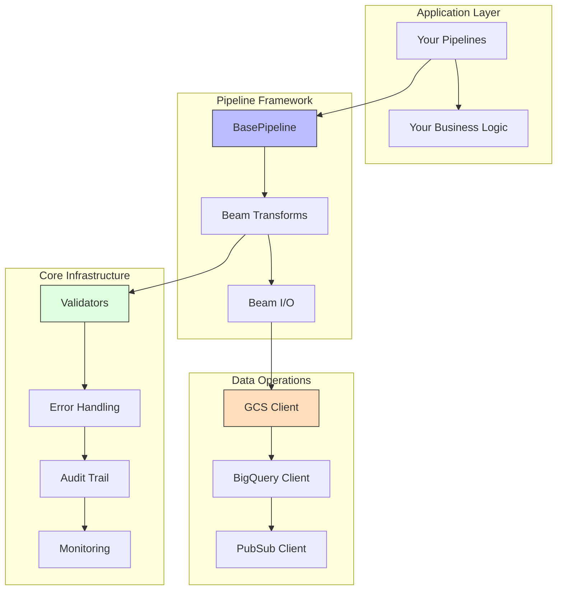
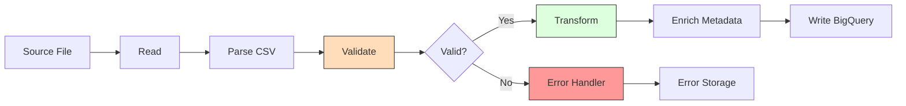
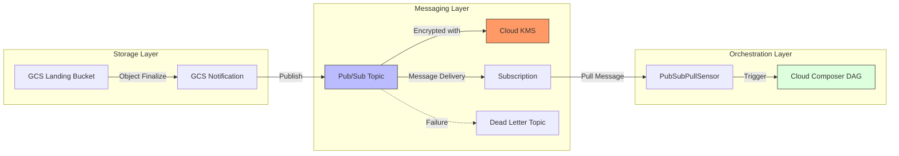
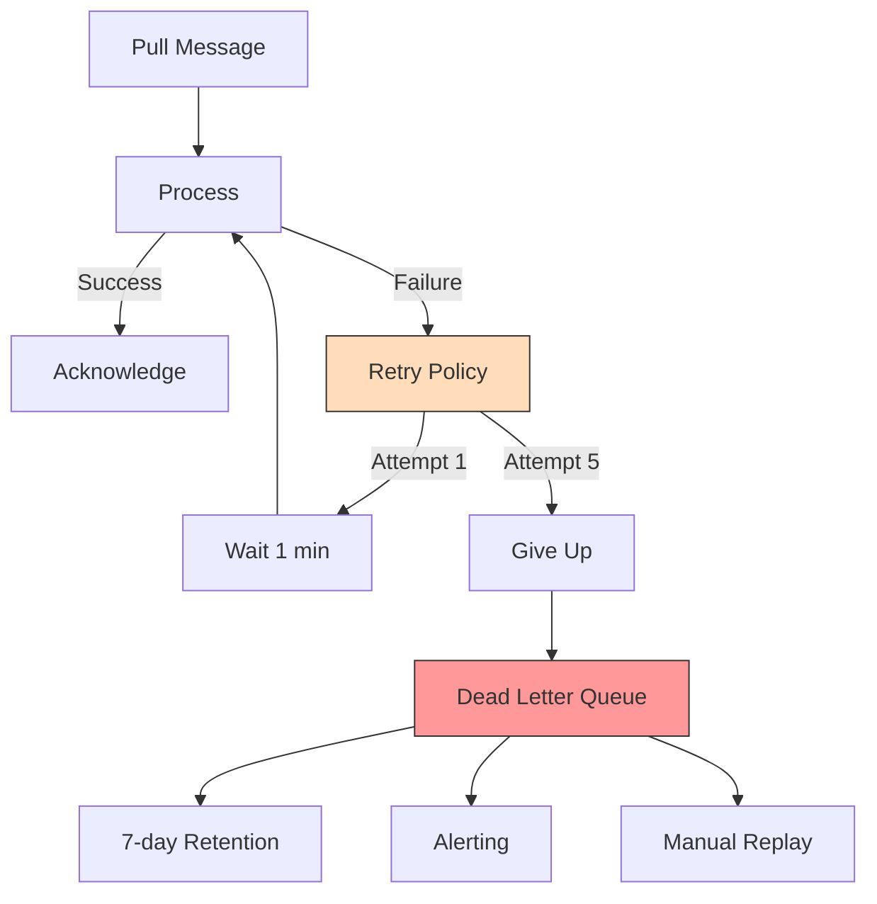

t# GCP Pipeline Builder

A production-grade Python framework for building GCP data pipelines. Provides reusable components for data migration including validation, error handling, audit trails, monitoring, and orchestration.

**Status**: ✅ Production Ready

> **📖 Part of the Legacy Mainframe to GCP Migration Framework**  
> This library is the foundation for all migration pipelines.
>
> **Reference Implementations:**
> - [EM Deployment](../../deployments/em/) - Multi-entity JOIN pattern (3 → 1)
> - [LOA Deployment](../../deployments/loa/) - Single-entity SPLIT pattern (1 → 2)

---

## Table of Contents

- [Features](#features)
- [Installation](#installation)
- [Quick Start](#quick-start)
- [Architecture](#architecture)
- [Core Modules](#core-modules)
  - [Validators](#1-validators-module)
  - [Error Handling](#2-error-handling-module)
  - [Audit & Reconciliation](#3-audit--reconciliation-module)
  - [Data Quality & Scoring](#4-data-quality--scoring-module)
  - [Monitoring & Observability](#5-monitoring--observability-module)
  - [Data Deletion Framework](#6-data-deletion-framework)
  - [Job Control](#7-job-control-module)
  - [Utilities](#8-utilities-module)
  - [Pipeline Components](#pipeline-components)
    - [Apache Beam Transforms](#9-apache-beam-transforms)
    - [Apache Beam I/O Operations](#10-apache-beam-io-operations)
    - [Pipeline Base Classes](#11-pipeline-base-classes)
  - [Orchestration](#orchestration)
    - [DAG Factory](#dag-factory)
    - [Pub/Sub Integration](#pubsub-integration-event-driven-triggers)
    - [Dead Letter Queue Management](#dead-letter-queue-dlq-management)
  - [Shared dbt Transformations](#shared-dbt-transformations)
  - [Common Patterns](#common-patterns)
  - [Testing](#testing)
  - [Project Structure](#project-structure)
  - [Best Practices](#best-practices)

---

## Features

- **Validators**: SSN, date, numeric, and custom validation rules
- **Error Handling**: Centralized error classification, routing, and retry logic
- **Audit**: Comprehensive audit trails and reconciliation
- **Monitoring**: Metrics collection and health checking
- **Clients**: GCS, BigQuery, Pub/Sub client wrappers
- **Orchestration**: DAG factory, routing, sensors, operators
- **Pipelines**: Apache Beam base classes, transforms, I/O operations
- **Data Quality**: Quality scoring, anomaly detection, reporting
- **File Management**: HDR/TRL parsing, archiving
- **Job Control**: Pipeline job tracking and status management

---

## Installation

```bash
pip install -e libraries/gcp-pipeline-builder
```

---

## Quick Start

```python
from gcp_pipeline_builder.validators import validate_ssn
from gcp_pipeline_builder.error_handling import ErrorHandler, ErrorContext
from gcp_pipeline_builder.audit import AuditTrail
from gcp_pipeline_builder.monitoring import MetricsCollector

# Validate data
errors = validate_ssn("123-45-6789")

# Handle errors with automatic classification and retry
handler = ErrorHandler(pipeline_name="my_job", run_id="run_001")
with ErrorContext(handler):
    result = process_data()

# Track execution
audit = AuditTrail(run_id="run_001", pipeline_name="my_job", entity_type="applications")
audit.record_processing_start("gs://bucket/input.csv")
audit.increment_counts(valid=100, errors=5)
audit.record_processing_end(success=True)

# Collect metrics
metrics = MetricsCollector(pipeline_name="my_job", run_id="run_001")
metrics.increment("records_processed", 100)
stats = metrics.get_statistics()
```

---

## Architecture

### Layer Overview

```
┌────────────────────────────────────────────────────────┐
│ Pipeline Framework Layer                               │
│ (Apache Beam: base pipeline, transforms, I/O ops)      │
├────────────────────────────────────────────────────────┤
│ Core Infrastructure Layer                              │
│ (Validators, error handling, audit, monitoring)        │
├────────────────────────────────────────────────────────┤
│ Data Operations & Orchestration Layer                  │
│ (GCS/BigQuery clients, DAG factory, utilities)         │
└────────────────────────────────────────────────────────┘
```

### Component Architecture



### Data Flow



---

## Core Modules

### 1. Validators Module

**Location**: `gcp_pipeline_builder.validators`

Standardized validation with PII masking and structured error reporting.

#### ValidationError

```python
from gcp_pipeline_builder.validators import ValidationError

error = ValidationError(
    field="ssn",
    value="123-45-6789",
    message="Invalid SSN format",
    error_type="VALIDATION_ERROR"
)
# String representation masks PII: field: message (value: ***-**-6789)
```

#### Available Validators

| Validator | Description |
|-----------|-------------|
| `validate_ssn(ssn)` | US Social Security Number validation |
| `validate_numeric_range(field, value, min, max)` | Numeric range with formatting |
| `validate_date(field, date_str, fmt, allow_future, max_age_years)` | Date format and constraints |
| `validate_branch_code(code)` | Bank branch code validation |
| `validate_required(field, value)` | Null/empty check |
| `validate_length(field, value, min_length, max_length)` | String length validation |

```python
from gcp_pipeline_builder.validators import validate_ssn, validate_numeric_range

# SSN validation
errors = validate_ssn("123-45-6789")
assert errors == []

# Numeric range with currency formatting
cleaned, errors = validate_numeric_range("loan_amount", "$1,234.56", min_value=0, max_value=100000)
assert cleaned == 1234.56
```

#### Schema-Driven Validation (SchemaValidator)

Automatically validate records against an `EntitySchema` - no manual validation code needed.

```python
from gcp_pipeline_builder.schema import EntitySchema, SchemaField
from gcp_pipeline_builder.validators import SchemaValidator

# Define schema with PII fields marked
CustomerSchema = EntitySchema(
    entity_name="customers",
    system_id="EM",
    fields=[
        SchemaField(name="customer_id", field_type="STRING", required=True),
        SchemaField(name="customer_name", field_type="STRING", required=True, max_length=100),
        SchemaField(name="ssn", field_type="STRING", required=True, is_pii=True),  # PII - masked in errors
        SchemaField(name="email", field_type="STRING", is_pii=True),  # PII - masked in errors
        SchemaField(name="status", field_type="STRING", allowed_values=["ACTIVE", "CLOSED"]),
    ],
    primary_key=["customer_id"],
)

# Validate records
validator = SchemaValidator(CustomerSchema)
errors = validator.validate(record)
```

#### Validation Checks

| Check | Schema Field | Description |
|-------|--------------|-------------|
| Required | `required=True` | Field must be present and non-empty |
| Allowed Values | `allowed_values=['A', 'B']` | Value must be in the list |
| Max Length | `max_length=50` | String length ≤ max_length |
| Type Check | `field_type='INTEGER'` | Value can be cast to type |

#### PII Masking Configuration

Mark sensitive fields with `is_pii=True` to automatically mask values in error messages:

```python
SchemaField(
    name="ssn",
    field_type="STRING",
    required=True,
    is_pii=True  # Values masked as "***6789" in error messages
)
```

| Field Type | Example Value | Masked Output |
|------------|--------------|---------------|
| SSN | `123-45-6789` | `***6789` |
| Short value | `1234` | `***` |
| Non-PII | `ACTIVE` | `ACTIVE` (not masked) |

#### In Beam Pipelines

```python
from gcp_pipeline_builder.pipelines.beam.transforms import SchemaValidateRecordDoFn

# Automatically routes valid/invalid records
validated = records | 'Validate' >> beam.ParDo(
    SchemaValidateRecordDoFn(schema=CustomerSchema)
).with_outputs('invalid', main='valid')

# Process valid records
validated.valid | 'WriteValid' >> beam.io.WriteToBigQuery(...)

# Handle invalid records
validated.invalid | 'WriteErrors' >> beam.io.WriteToBigQuery(...)
```

---

### 2. Error Handling Module

**Location**: `gcp_pipeline_builder.error_handling`

Production-grade error management with automatic classification and configurable retry strategies.

#### ErrorContext (Context Manager)

```python
from gcp_pipeline_builder.error_handling import ErrorContext, ErrorHandler

handler = ErrorHandler(pipeline_name="my_job", run_id="run_001")

with ErrorContext(handler, operation_name="process_record"):
    result = process_record(record)
    # Errors are automatically caught, classified, logged, and retried

# Access error info after processing
stats = handler.get_statistics()
errors = handler.get_all_errors()
```

#### Error Classification

Errors are automatically classified by **Severity** and **Category**:

| Severity | Description |
|----------|-------------|
| `CRITICAL` | Pipeline cannot continue |
| `HIGH` | Significant data loss risk |
| `MEDIUM` | Can retry |
| `LOW` | Non-blocking |
| `INFO` | Informational |

| Category | Description |
|----------|-------------|
| `VALIDATION` | Data validation failures |
| `INTEGRATION` | External service failures |
| `CONFIGURATION` | Config issues |
| `RESOURCE` | Resource exhaustion |
| `DATA_QUALITY` | Quality rule violations |

#### Retry Strategies

```python
from gcp_pipeline_builder.error_handling import RetryStrategy

# Built-in strategies:
# EXPONENTIAL_BACKOFF - Delays increase exponentially (1s, 2s, 4s, 8s...)
# FIXED_DELAY - Consistent delay between retries
# LINEAR - Delays increase linearly (1s, 2s, 3s, 4s...)
# NO_RETRY - Don't retry
```

---

### 3. Audit & Reconciliation Module

**Location**: `gcp_pipeline_builder.audit`

Tracks data integrity, prevents reprocessing, and enables reconciliation.

```python
from gcp_pipeline_builder.audit import AuditTrail

audit = AuditTrail(
    run_id="run_20231225_001",
    pipeline_name="loa_applications",
    entity_type="applications"
)

# Record processing
audit.record_processing_start(source_file="gs://bucket/file.csv")
audit.increment_counts(valid=1000, errors=5)
audit_record = audit.record_processing_end(success=True)
```

#### Additional Components

| Component | Purpose |
|-----------|---------|
| `DuplicateDetector` | Prevents processing duplicate records |
| `ReconciliationEngine` | Compare source vs destination counts |
| `DataLineage` | Track data flow from source to destination |

---

### 4. Data Quality & Scoring Module

**Location**: `gcp_pipeline_builder.data_quality`

Orchestrates multiple dimensions of data quality and provides a consolidated score.

```python
from gcp_pipeline_builder.data_quality import DataQualityChecker

checker = DataQualityChecker(entity_type="customers")

# Check multiple dimensions
checker.check_completeness(records, required_fields=["id", "ssn"])
checker.check_validity(records, validation_rules={"ssn": validate_ssn})
checker.check_uniqueness(records, unique_key="id")

# Get results
score = checker.calculate_overall_quality_score()  # 0.0 to 1.0
report = checker.get_quality_report()
checker.print_quality_report()
```

#### Utility Functions

| Function | Purpose |
|----------|---------|
| `check_duplicate_keys(records, key_fields)` | Detect duplicate primary/composite keys |
| `validate_row_types(lines)` | Verify HDR first, TRL last, no HDR/TRL in middle |

---

### 5. Monitoring & Observability Module

**Location**: `gcp_pipeline_builder.monitoring`

```python
from gcp_pipeline_builder.monitoring import MetricsCollector, HealthChecker

metrics = MetricsCollector(pipeline_name="loa_job", run_id="run_001")

# Counters
metrics.increment("records_processed", 1)

# Gauges
metrics.set_gauge("queue_size", 250.0)

# Histograms
metrics.record_histogram("record_size_bytes", 1024)

# Timers with context manager
with metrics.start_timer() as timer:
    results = process_data()
    
# Get statistics
stats = metrics.get_statistics()
```

---

### 6. Data Deletion Framework

**Location**: `gcp_pipeline_builder.data_deletion`

Handles lifecycle of malformed records, including quarantine, approval, and deletion.

```python
from gcp_pipeline_builder.data_deletion import DataDeletionFramework

framework = DataDeletionFramework(pipeline_name="loa_migration", run_id="run_001")

# Detect and quarantine malformed records
framework.detect_malformed_record(
    record_id="REC001",
    entity_type="applications",
    data={"id": "REC001", "ssn": "invalid"},
    validation_errors=["Invalid SSN format"],
    severity="HIGH"
)

# Manage deletion lifecycle
framework.request_deletion_approval(record)
framework.approve_deletion(record, approved_by="admin@example.com")
framework.delete_record(record)

# Reporting
report = framework.get_deletion_report()
```

---

### 7. Job Control Module

**Location**: `gcp_pipeline_builder.job_control`

Tracks pipeline job status and metadata in BigQuery for operational visibility.

```python
from gcp_pipeline_builder.job_control import JobControlRepository, JobStatus, PipelineJob

repo = JobControlRepository(project_id="my-project")

# Create a new job record
job = PipelineJob(run_id="run_001", pipeline_name="em_sync", system_id="EM")
repo.create_job(job)

# Update job status
repo.update_status("run_001", JobStatus.RUNNING)
repo.update_status("run_001", JobStatus.SUCCESS, total_records=1000)

# Mark as failed
repo.mark_failed(
    run_id="run_001",
    error_code="PARSE_ERROR",
    error_message="Invalid CSV format",
    failure_stage="ODP_LOAD"
)
```

---

### 8. Utilities Module

**Location**: `gcp_pipeline_builder.utilities`

```python
from gcp_pipeline_builder.utilities import generate_run_id, discover_split_files, build_gcs_path

# Generate unique run ID
run_id = generate_run_id(job_name="loa_migration")
# Format: loa_migration_YYYYMMDD_HHMMSS_<uuid>

# Discover split files
files = discover_split_files(client, bucket="my-bucket", prefix="input/", pattern="app_*.csv")

# Build GCS path
path = build_gcs_path(bucket="my-bucket", prefix="output/", filename="results.csv")
# Returns: gs://my-bucket/output/results.csv
```

---

## Pipeline Components

### 6. Apache Beam Transforms

**Location**: `gcp_pipeline_builder.pipelines.beam.transforms`

| Transform | Description |
|-----------|-------------|
| `ParseCsvLine` | Parse CSV lines into dictionaries |
| `ValidateRecordDoFn` | Validate records against rules |
| `FilterRecordsDoFn` | Filter based on predicates |
| `TransformRecordDoFn` | Transform record fields |
| `EnrichWithMetadataDoFn` | Add audit metadata |
| `DeduplicateRecordsDoFn` | Remove duplicates |

```python
import apache_beam as beam
from gcp_pipeline_builder.pipelines.beam.transforms import ParseCsvLine, EnrichWithMetadataDoFn

(pipeline
    | 'Read' >> beam.io.ReadFromText('input.csv')
    | 'Parse' >> beam.ParDo(ParseCsvLine(['id', 'name', 'email']))
    | 'Enrich' >> beam.ParDo(EnrichWithMetadataDoFn(run_id='run_001', pipeline_name='my_pipeline'))
)
```

---

### 7. Apache Beam I/O Operations

**Location**: `gcp_pipeline_builder.pipelines.beam.io`

| Operation | Description |
|-----------|-------------|
| `ReadFromGCSDoFn` | Read files from GCS |
| `WriteToGCSDoFn` | Write files to GCS |
| `ReadCSVFromGCSDoFn` | Read and parse CSV from GCS |
| `WriteToBigQueryDoFn` | Stream to BigQuery |
| `BatchWriteToBigQueryDoFn` | Batch load to BigQuery |
| `PublishToPubSubDoFn` | Publish to Pub/Sub |

---

### 8. Pipeline Base Classes

**Location**: `gcp_pipeline_builder.pipelines.base`

```python
from gcp_pipeline_builder.pipelines.base import BasePipeline, PipelineConfig
import apache_beam as beam

class MyPipeline(BasePipeline):
    def build(self, pipeline: beam.Pipeline):
        (pipeline
            | 'Read' >> beam.io.ReadFromText(self.config.source_file)
            | 'Process' >> beam.ParDo(self.process_fn)
            | 'Write' >> beam.io.WriteToBigQuery(self.config.bigquery_dataset)
        )

config = PipelineConfig(run_id='run_001', pipeline_name='my_job', source_file='gs://...')
pipeline = MyPipeline(config=config)
result = pipeline.run()
```

---

## Orchestration

### DAG Factory

**Location**: `gcp_pipeline_builder.orchestration.factories`

Automates the creation of Airflow DAGs with standardized patterns.

```python
from gcp_pipeline_builder.orchestration.factories import DAGFactory

factory = DAGFactory()

# Create DAG from a configuration dictionary
dag_config = {
    "dag_id": "em_customer_migration",
    "schedule_interval": "@daily",
    "default_args": {
        "owner": "data-engineering",
        "start_date": "2023-01-01"
    }
}
dag = factory.create_dag_from_dict(dag_config)
```

### Pub/Sub Integration (Event-Driven Triggers)

The library uses a **pull-based strategy** for Pub/Sub integration.



#### Why Pull Strategy?

| Aspect | Pull (Library Choice) | Push |
|--------|----------------------|------|
| **Backpressure** | ✅ Consumer controls pace | ❌ Can overwhelm |
| **Retry Control** | ✅ Consumer decides when | ❌ Limited |
| **Ordering** | ✅ Guaranteed | ❌ Harder |
| **Reliability** | ✅ Retained until ACK | ❌ Fire and forget |

#### Using BasePubSubPullSensor

```python
from gcp_pipeline_builder.orchestration.sensors import BasePubSubPullSensor

class MySystemPubSubSensor(BasePubSubPullSensor):
    def __init__(self, *args, **kwargs):
        super().__init__(
            *args,
            filter_extension='.ok',
            metadata_xcom_key='file_info',
            **kwargs
        )
```

---

### Dead Letter Queue (DLQ) Management



#### DLQ Error Types

| Error Type | Description |
|------------|-------------|
| `VALIDATION_FAILURE` | Bad HDR/TRL, checksum mismatch |
| `SCHEMA_MISMATCH` | Column changes, type errors |
| `DATA_QUALITY` | Invalid values, duplicates |
| `PROCESSING_ERROR` | Dataflow errors, timeouts |
| `ROUTING_FAILURE` | Unknown entity, bad metadata |

```python
from gcp_pipeline_builder.orchestration.callbacks import on_failure_callback, publish_to_dlq

# Configure in DAG
default_args = {
    'on_failure_callback': on_failure_callback,
}
```

---

### Shared dbt Transformations

**Location**: `gcp_pipeline_builder.transformations.dbt_shared`

Reusable dbt macros for common data transformation and quality tasks.

| Macro | Description |
|-------|-------------|
| `audit_columns()` | Adds standard audit columns (`_run_id`, `_processed_at`, etc.) |
| `pii_masking(column, type)` | Masks sensitive data like SSN or Account numbers |
| `data_quality_check(rules)` | Implements complex DQ rules within SQL |

---

## Common Patterns

### Pattern 1: CSV to BigQuery Pipeline

```python
from gcp_pipeline_builder.pipelines.base import BasePipeline, PipelineConfig
from gcp_pipeline_builder.pipelines.beam.transforms import ParseCsvLine, EnrichWithMetadataDoFn

class CSVToBigQueryPipeline(BasePipeline):
    def build(self, pipeline):
        (pipeline
            | 'Read' >> beam.io.ReadFromText(self.config.source_file)
            | 'Parse' >> beam.ParDo(ParseCsvLine(['id', 'name', 'email']))
            | 'Enrich' >> beam.ParDo(EnrichWithMetadataDoFn(
                run_id=self.config.run_id,
                pipeline_name=self.config.pipeline_name
            ))
            | 'Write' >> beam.io.WriteToBigQuery('dataset.table')
        )
```

### Pattern 2: Full Pipeline with Audit & Monitoring

```python
from gcp_pipeline_builder.audit import AuditTrail
from gcp_pipeline_builder.monitoring import MetricsCollector
from gcp_pipeline_builder.error_handling import ErrorHandler, ErrorContext

def migrate_data(source_file, config):
    run_id = 'run_20231225_001'
    audit = AuditTrail(run_id=run_id, pipeline_name='migration', entity_type='apps')
    metrics = MetricsCollector(pipeline_name='migration', run_id=run_id)
    error_handler = ErrorHandler(pipeline_name='migration', run_id=run_id)
    
    audit.record_processing_start(source_file)
    
    for record in read_source(source_file):
        with ErrorContext(error_handler):
            metrics.increment('records_read')
            validate_record(record)
            load_to_bigquery(record)
            metrics.increment('records_loaded')
    
    audit.record_processing_end(success=True)
    return metrics.get_statistics()
```

### Pattern 3: HDR/TRL File Validation

```python
from gcp_pipeline_builder.file_management import (
    HDRTRLParser, validate_record_count, validate_checksum
)
from gcp_pipeline_builder.data_quality import validate_row_types

parser = HDRTRLParser()
metadata = parser.parse_file_lines(lines)

# Validate structure
is_valid, msg = validate_row_types(lines)

# Validate counts
is_valid, msg = validate_record_count(lines, expected_count=metadata.trailer.record_count)

# Validate checksum
is_valid, msg = validate_checksum(data_lines, metadata.trailer.checksum)
```

---

## Testing

> **Note**: Testing utilities have been extracted to `gcp-pipeline-tester`.
> See [GCP Pipeline Tester](../gcp-pipeline-tester/README.md).

```python
# Install test library
pip install -e libraries/gcp-pipeline-tester

# Use in tests
from gcp_pipeline_tester import BaseGDWTest, BaseBeamTest
from gcp_pipeline_tester.mocks import GCSClientMock, BigQueryClientMock
```

### Run Library Tests

```bash
cd libraries/gcp-pipeline-builder
./run_tests.sh

# Or manually
PYTHONPATH=src pytest tests/ -v --cov=src/gcp_pipeline_builder
```

---

## Project Structure

```
gcp-pipeline-builder/
├── README.md                    # This file
├── pyproject.toml               # Package configuration
├── pytest.ini                   # Test configuration
├── run_tests.sh                 # Test runner script
├── src/
│   └── gcp_pipeline_builder/
│       ├── __init__.py
│       ├── audit/               # Audit trails and reconciliation
│       ├── clients/             # GCS, BigQuery, Pub/Sub clients
│       ├── data_deletion/       # Data deletion framework
│       ├── data_quality/        # Quality checks and scoring
│       ├── error_handling/      # Error classification and retry
│       ├── file_management/     # HDR/TRL parsing, archiving
│       ├── job_control/         # Pipeline job tracking
│       ├── monitoring/          # Metrics and health checks
│       ├── orchestration/       # DAG factory, routing, sensors
│       ├── pipelines/           # Apache Beam base classes
│       ├── transformations/     # dbt macros
│       ├── utilities/           # Common utilities
│       └── validators/          # Validation logic
└── tests/
    └── unit/                    # Unit tests
```

---

## Best Practices

### Error Handling

Always use `ErrorContext`:

```python
with ErrorContext(handler, operation_name="important_operation"):
    result = do_work()
```

### Metrics

Collect meaningful metrics:

```python
metrics.increment("records_processed")
metrics.increment("records_valid")
metrics.set_gauge("queue_size", current_size)
```

### Type Hints

Use complete type hints:

```python
def process_records(records: List[Dict[str, Any]]) -> Tuple[int, int]:
    """Process records and return (success, error) counts."""
    ...
```

### Testing

Write tests for all functionality using `gcp-pipeline-tester`:

```python
from gcp_pipeline_tester import BaseGDWTest

class TestMyModule(BaseGDWTest):
    def test_my_function(self):
        result = my_function(input_data)
        self.assertEqual(result, expected_output)
```

---

## Related Libraries

- **[gcp-pipeline-tester](../gcp-pipeline-tester/README.md)**: Testing utilities (mocks, fixtures, assertions)

---

## License

This library is part of the Legacy Migration Reference project.

