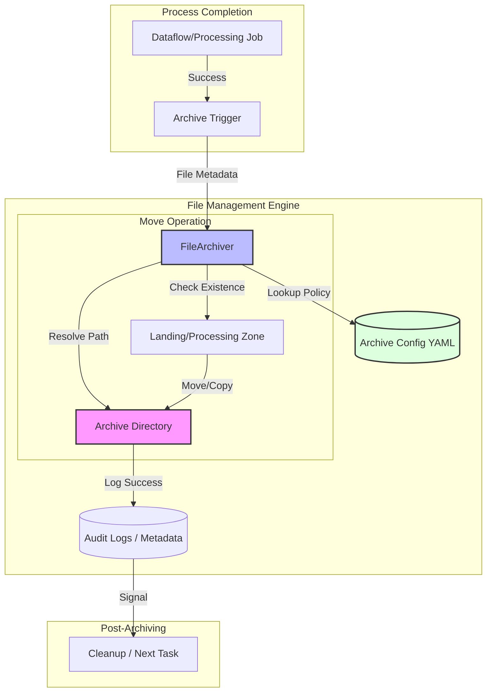

### Ticket Description: Generic File Management & Archiving Component
**Ticket ID:** LOA-PLAT-002 (Generic Platform Ticket)  
**Status:** Defined  
**Priority:** MEDIUM  
**Epic:** Epic 4: Messaging & Integration (Platform Foundation)

#### 1. Objective
Develop a standardized, reusable component for file management and archiving. This ticket focuses on the "Archiver" utility that handles the post-processing movement of files from landing/processing zones to an archive directory. This ensures data lineage is preserved, prevents re-processing of the same files, and provides a modular interface for multi-pipeline re-use.

#### 2. Acceptance Criteria
*   **AC 1: Config-Driven Archiving Path**
    *   **Given** a completed processing task for a specific file
    *   **When** the archiving module is invoked
    *   **Then** it must determine the target archive path based on a central configuration (YAML/Dict)
    *   **And** support dynamic path templating (e.g., `archive/{entity}/{year}/{month}/{day}/{filename}`).
*   **AC 2: Atomic File Movement**
    *   **Given** a file in the landing or processing bucket
    *   **When** moved to the archive
    *   **Then** the operation must be atomic (copy + delete or move) to ensure no data loss
    *   **And** handle potential collisions (e.g., appending a timestamp or UUID if a file with the same name exists).
*   **AC 3: Metadata Logging & Success Signal**
    *   **Given** a successful archive operation
    *   **When** the process completes
    *   **Then** it must log the original path, the archive path, and the timestamp
    *   **And** return a success signal to the orchestration layer (Airflow) to allow downstream cleanup or status updates.

#### 3. Technical Requirements
- **FileArchiver Class**: A modular Python class that abstracts GCS (or local/S3) operations.
- **Archive Policy Engine**: Logic to decide archive retention or path structures based on `file_type` or `source`.
- **Error Handling**: Robust handling for "File Not Found" (if a file was already moved) or "Permission Denied".
- **Library Readiness**: Code must be written as modular Python classes (e.g., `BaseFileArchiver`, `GCSFileArchiver`) to enable re-use across different data products.

#### 4. Workflow Diagram

#### 5. Definition of Done
- [ ] `FileArchiver` class implemented with support for GCS.
- [ ] Unit tests covering path resolution, collision handling, and error cases.
- [ ] Integration in a "Template DAG" showing the `Processing -> Archiving` flow.
- [ ] Documentation of the "Archiving Standard" including path conventions.
- [ ] 100% test coverage for standalone archiving logic.
