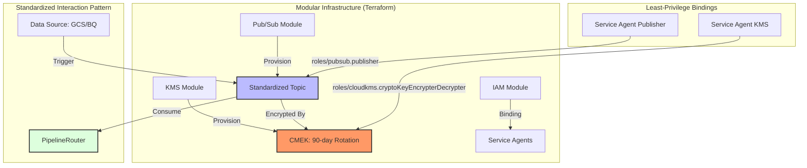

### Ticket Description: Generic Pattern for Secure Messaging & CMEK Infrastructure
**Ticket ID:** PLAT-INF-001 (Generic Platform Infrastructure)  
**Status:** Defined  
**Priority:** HIGH  
**Epic:** Epic 4: Messaging & Integration (Platform Foundation)

#### 1. Objective
Establish a reusable, modular pattern for provisioning secure messaging infrastructure using Pub/Sub and Cloud KMS (CMEK). The goal is to define infrastructure-as-code (Terraform) and service interaction patterns that are environment-agnostic and ready to be encapsulated into shared modules/libraries.

#### 2. Acceptance Criteria (Generic & Reusable)
*   **AC 1: Standardized Encryption Pattern**
    *   **Given** a requirement for data encryption at rest
    *   **When** provisioning any messaging or storage resource (Pub/Sub, GCS, BQ)
    *   **Then** it must utilize a Customer-Managed Encryption Key (CMEK) with a mandatory 90-day rotation policy.
*   **AC 2: Decoupled Infrastructure Modules**
    *   **Given** the Terraform configuration
    *   **When** defining KMS and Pub/Sub resources
    *   **Then** they must be structured as standalone, parameterized modules (using `variables.tf`) rather than hardcoded project-specific resources.
*   **AC 3: Modular IAM Least-Privilege Pattern**
    *   **Given** service-to-service interactions (GCS -> Pub/Sub, Pub/Sub -> KMS)
    *   **When** applying IAM bindings
    *   **Then** they must use standardized service agent identifiers (e.g., `service-${project_number}@gcp-sa-pubsub...`) to ensure the pattern is portable across any GCP project.
*   **AC 4: Event-Driven Sensing Interface**
    *   **Given** a need for event-driven triggers
    *   **When** configuring GCS notifications
    *   **Then** the notification must publish to a standardized topic structure that the `PipelineRouter` (PLAT-ROUT-001) can consume.

#### 3. Technical Requirements (Library Readiness)
- **Terraform Parameterization**: Mandatory use of `environment`, `project_id`, and `region` variables for all resource naming and placement.
- **Resource Naming Convention**: Use a consistent prefix/suffix pattern (e.g., `${prefix}-messaging-key`, `${prefix}-notifications-topic`) to allow for multi-tenant or multi-project reuse.
- **Common Service Agent Registry**: Maintain a list of required service agents and their specific roles (Encrypter/Decrypter, Publisher) to ensure repeatable security setup.

#### 4. Design Pattern Diagram

#### 5. Definition of Done
- [ ] Terraform modules for KMS and Pub/Sub are validated and "pluggable".
- [ ] IAM bindings are proven to be least-privilege via audit logs.
- [ ] The pattern is documented as a "Platform Standard" in the Architecture guide.
- [ ] Successfully verified through at least one reference implementation (e.g., LOA Migration).
