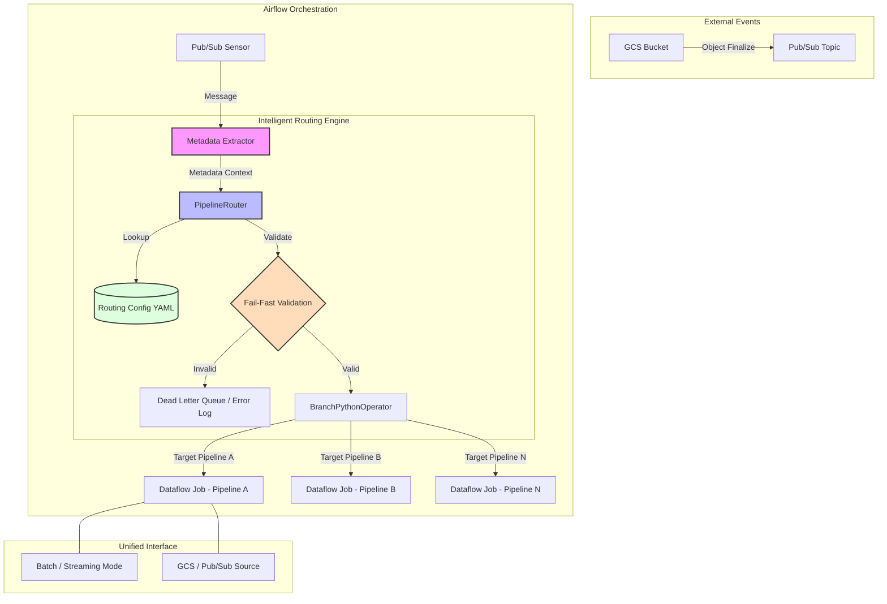

### Ticket Description: Generic Intelligent Routing & Orchestration Component
**Ticket ID:** LOA-PLAT-001 (Generic Platform Ticket)  
**Status:** Defined  
**Priority:** HIGH  
**Epic:** Epic 4: Messaging & Integration (Platform Foundation)
**Dependencies:** LOA-INF-005 (Secure Event-Driven Trigger - KMS/IAM)

#### 1. Objective
Develop a standardized, reusable component for event-driven data processing. This ticket focuses on the "Routing Engine" that handles metadata extraction, intelligent routing, and unified processing patterns, ensuring that business logic is decoupled from orchestration. This component is designed for multi-pipeline re-use and portability.

#### 2. Acceptance Criteria
*   **AC 1: Modular Metadata Extraction (Pub/Sub Pull Strategy)**
    *   **Given** a Pub/Sub message from a GCS notification
    *   **When** processed by the `LOAPubSubPullSensor` (Pull-based strategy)
    *   **Then** it must extract a consistent set of metadata (e.g., source, entity, file_type, processing_mode)
    *   **And** ensure message acknowledgment is managed (e.g., `ack_messages=True` after extraction)
    *   **And** inject this metadata into the Airflow workflow context (`loa_metadata`).
*   **AC 2: Config-Driven Routing Engine**
    *   **Given** the extracted metadata
    *   **When** the `PipelineRouter` logic is invoked via a `BranchPythonOperator` (or similar)
    *   **Then** it must determine the correct target pipeline/DAG based on a central configuration (YAML/Dict)
    *   **And** it must support "Fail-Fast" validation (e.g., checking for required columns) before triggering compute resources.
*   **AC 3: Unified Processing Interface**
    *   **Given** the routed task
    *   **When** the Dataflow job is initiated
    *   **Then** the base implementation must support a dual-mode interface (Batch/Streaming)
    *   **And** allow toggling between GCS and Pub/Sub sources without re-writing core transformation logic.
*   **AC 4: Observability and Error Handling**
    *   **Given** a routing failure or invalid metadata
    *   **When** the "Fail-Fast" validation detects an issue
    *   **Then** the message must be routed to a Dead Letter Queue (DLQ) or a specific error-handling task
    *   **And** the error must be logged with sufficient context (file name, reason for failure) for monitoring.

#### 3. Technical Requirements
- **LOAPubSubPullSensor**: Implementation of a pull-based sensor that inherits from `PubSubPullSensor`. It must support:
    - Long-polling to minimize empty responses.
    - Automatic XCom injection of `loa_metadata`.
    - Idempotency (handling the same GCS notification message multiple times).
- **PipelineSelector/Router**: Logic to map file patterns/metadata to specific Task IDs or DAG IDs.
- **Config Layer**: A YAML-based or JSON-based registry of file types, target tables, and schema requirements.
- **Unified Dataflow Interface**: A base class/wrapper for Dataflow operators that abstracts the source (GCS/PubSub) and mode (Batch/Streaming).
- **Security & Encryption**: Integration with Cloud KMS (provisioned via LOA-INF-005) for accessing encrypted Pub/Sub messages. Ensure the `LOAPubSubPullSensor` and Dataflow jobs use service accounts with the necessary IAM roles.
- **Standardized Context**: Use of Airflow XComs or specific variable injection to pass `routing_info` between tasks.
- **Library Readiness**: Code must be written as modular Python classes (e.g., `BasePipelineRouter`, `PipelineConfig`) to enable re-use across different data products.

#### 4. Workflow Diagram

#### 5. Definition of Done
- [ ] `LOAPubSubPullSensor` verified for pull-based metadata extraction and XCom injection.
- [ ] `PipelineRouter` class implemented and unit-tested.
- [ ] `BaseDataflowOperator` wrapper implemented to support unified source/mode interface.
- [ ] DLQ and error logging mechanism verified for invalid routing.
- [ ] Reference implementation in a "Template DAG" showing the `Sensor -> Router -> Branch` flow.
- [ ] Documentation of the "Routing Standard" for future legacy migrations.
- [ ] 100% test coverage for standalone routing logic.
