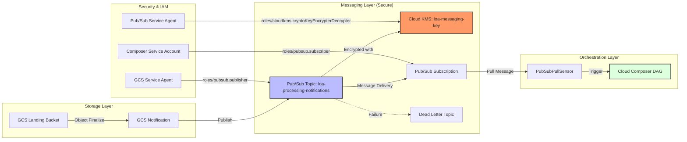

### Ticket Description: Secure Event-Driven Trigger for LOA Pipeline (Pub/Sub + KMS + IAM)

**Ticket ID:** LOA-INF-005  
**Status:** In Progress  
**Owner:** [REDACTED]  
**Epic:** Epic 4: Messaging & Integration  
**Dependencies:** LOA-PLAT-001 (Intelligent Routing & Orchestration Framework)

#### 1. Objective
Implement the secure, reliable infrastructure for an event-driven trigger. This includes provisioning CMEK-enabled Pub/Sub topics and KMS keys, and configuring GCS notifications to trigger messages upon `.ok` file arrival. This ticket provides the "Plumbing" that the Intelligent Routing Framework (LOA-PLAT-001) will consume.

#### 2. Acceptance Criteria
The following criteria must be met to satisfy the business and security requirements:

*   **AC 1: Secure Infrastructure Provisioning**
    *   **Given** the Terraform configuration for KMS and Pub/Sub
    *   **When** applied to the GCP environment
    *   **Then** a KMS KeyRing and CryptoKey must be created with a mandatory 90-day rotation policy
    *   **And** the Pub/Sub topic must be encrypted using this Customer-Managed Encryption Key (CMEK).

*   **AC 2: Reliable Event-Driven Trigger**
    *   **Given** a landing bucket in GCS
    *   **When** a control file (ending in `.ok`) is uploaded to the `incoming/` directory
    *   **Then** a GCS notification must immediately publish a message to the `loa-processing-notifications` topic
    *   **And** the system must ensure message delivery with a 7-day retention and dead-lettering enabled.

*   **AC 3: Least-Privilege Orchestration**
    *   **Given** the Cloud Composer data pipeline
    *   **When** waiting for new data
    *   **Then** it must use a `PubSubPullSensor` to trigger the DAG immediately upon message arrival
    *   **And** all service interactions (GCS to Pub/Sub, Composer to Pub/Sub, KMS access) must be restricted to the minimum required IAM roles.

#### 3. Technical Requirements

**A. KMS Infrastructure (Security)**
- **KeyRing:** `loa-key-ring-${var.environment}`
- **CryptoKey:** `loa-messaging-key`
- **Location/Region:** `var.region` (Default: `europe-west2`)
- **Key Purpose:** `ENCRYPT_DECRYPT`
- **Rotation Policy:** 90 days (Rotation period: `7776000s`)
- **Apply KMS key to Pub/Sub topic encryption:** Enabled

**B. Pub/Sub Resources**
- **Topic:** `loa-processing-notifications`
- **Subscription (if Composer pulls):** `loa-processing-notifications-sub`
- **Dead-letter topic/subscription:** `loa-notifications-dead-letter`
- **Message retention:** 7 days (`604800s`)
- **Ack deadline:** 60 seconds.
- **Ordering requirements:** Enabled (`enable_message_ordering = true`)

**C. Storage Notification (GCS to Pub/Sub)**
- **Trigger condition:** `.ok` file landed successfully in Landing Directory (GCS)
- **Publish event:** Pub/Sub message triggered after `.ok` file arrival
- **Configure `google_storage_notification`:**
    - Bucket: `google_storage_bucket.data.name`
    - Event Type: `OBJECT_FINALIZE`
    - Object Name Prefix: `incoming/`
    - *Note: Filtering for `.ok` suffix is handled at the consumer level.*

**D. IAM and Security (Least Privilege)**
- **Grant publisher permissions to GCS notification service:** `service-PROJECT_NUMBER@gs-project-accounts.iam.gserviceaccount.com` granted `roles/pubsub.publisher`.
- **Grant subscriber permissions to Composer/consumer SA:** `loa-composer-${var.environment}` granted `roles/pubsub.subscriber`.
- **Grant Pub/Sub service agent access to KMS key:** `service-PROJECT_NUMBER@gcp-sa-pubsub.iam.gserviceaccount.com` granted `roles/cloudkms.cryptoKeyEncrypterDecrypter`.
- **Grant GCS service agent access to KMS key:** `service-PROJECT_NUMBER@gs-project-accounts.iam.gserviceaccount.com` granted `roles/cloudkms.cryptoKeyEncrypterDecrypter`.

**E. Terraform Delivery**
- **Implement Pub/Sub + KMS via Terraform:** Resources defined in `security.tf` and `loa-infrastructure.tf`.
- **Include env-specific variables:** Supported via `var.environment` (dev, staging, prod).
- **Ensure terraform fmt/validate/plan succeeds.**

**F. Integration check**
- **Validate `.ok` file landing produces Pub/Sub message.**
- **Consumer:** Cloud Composer DAG triggers based on the Pub/Sub message via `PubSubPullSensor`.

#### 4. Infrastructure Diagram

#### 5. Definition of Done
- [ ] Terraform plan shows successful creation of KMS keys, storage notifications, and IAM bindings.
- [ ] Uploading an `.ok` file to `gs://{project}-loa-data/incoming/` generates a message in `loa-processing-notifications`.
- [ ] The Pub/Sub message is encrypted with the specified KMS key.
- [ ] Cloud Composer DAG is automatically triggered upon message arrival.
- [ ] Audit logs confirm correct service account usage and successful encryption/decryption events.
- [ ] `security.tf` is updated and committed to the `blueprint/infrastructure/terraform/` directory.
