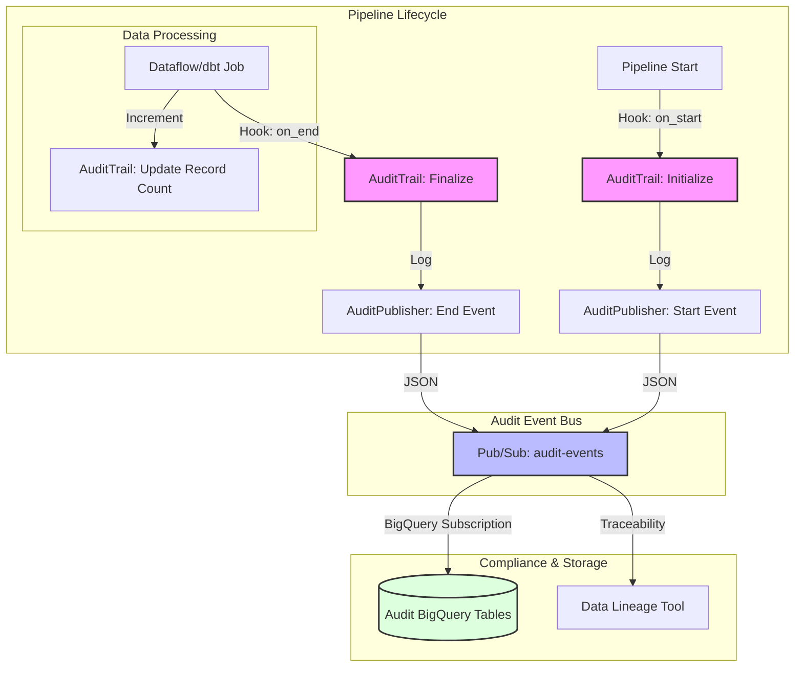

# JIRA TICKET: CORE-AUD-001 | Implement Standardized Audit & Compliance Framework

## 📋 Summary
Implement a unified, event-driven auditing mechanism for data pipelines (e.g., LOA migration) to ensure traceability, data integrity, and regulatory compliance across the enterprise data platform.

---

## 📖 Description
**As a** Data Compliance Officer / Pipeline Engineer,  
**I want** a standardized way to track every pipeline execution and verify record counts,  
**So that** we can provide a verifiable audit trail for regulators and ensure 100% data reconciliation between source systems and the cloud.

### 🎯 Business Value
- **Regulatory Compliance**: Meets enterprise standards for data lineage and financial auditing.
- **Operational Reliability**: Enables automated detection of data loss or corruption during processing or migration.
- **Developer Efficiency**: Provides a "zero-code" integration via the core library, reducing manual effort for each new pipeline implementation.

---

## ✅ Acceptance Criteria
- [ ] **Automated Lifecycle**: Auditing must trigger automatically at pipeline start and completion without manual intervention in the business logic.
- [ ] **Cryptographic Integrity**: Every audit record must contain a SHA-256 `audit_hash` calculated from `run_id`, `source_file`, `record_count`, and `timestamp`.
- [ ] **Non-Blocking Architecture**: Failure to publish an audit event must NOT cause the primary data pipeline to fail.
- [ ] **Event-Driven Delivery**: Audit records must be published as JSON events to a centralized message bus (e.g., `audit-events` topic).
- [ ] **Schema Compliance**: All published events must strictly adhere to the standardized `AUDIT_LOG_SCHEMA`.

---

## 🛠 Technical Implementation Details

### Data Contract (`AuditRecord`)
The implementation must populate the following fields:
- `run_id`: UUID or timestamp-prefixed execution identifier.
- `pipeline_name`: Name of the job (e.g., `loa_daily`, `customer_ingestion`).
- `entity_type`: Category of data (e.g., `applications`, `transactions`).
- `source_file`: The URI/path of the input data.
- `record_count`: Total records (Valid + Errors).
- `audit_hash`: SHA-256 digital signature of the run's metadata.

### Core Components
1. **AuditTrail (State Manager)**: Tracks timestamps and increments record counts throughout the pipeline lifecycle.
2. **AuditPublisher (Event Emitter)**: Handles serialization and secure message transmission.
3. **Base Class Integration**: Hooks the audit lifecycle into standard pipeline execution stages (e.g., `on_start`, `on_end`).

---

### Auditing Workflow Diagram

## 📋 Sub-Tasks
- [ ] Implement/Update `AuditTrail` logic in core data library.
- [ ] Create `AuditPublisher` with resilient error handling and non-blocking logic.
- [ ] Integrate auditing into `BasePipeline` lifecycle hooks for automated tracking.
- [ ] Configure reference implementation (e.g., `loa_daily_pipeline`) to use the new audit framework.
- [ ] Verify schema compatibility with central Audit BigQuery tables.

---

## 📚 References
- **Implementation Guide**: `blueprint/docs/05-technical-guides/AUDIT_INTEGRATION_GUIDE.md`
- **Schema Definition**: `blueprint/components/loa_domain/schema.py`
- **Core Library**: `gdw_data_core/core/audit/`
